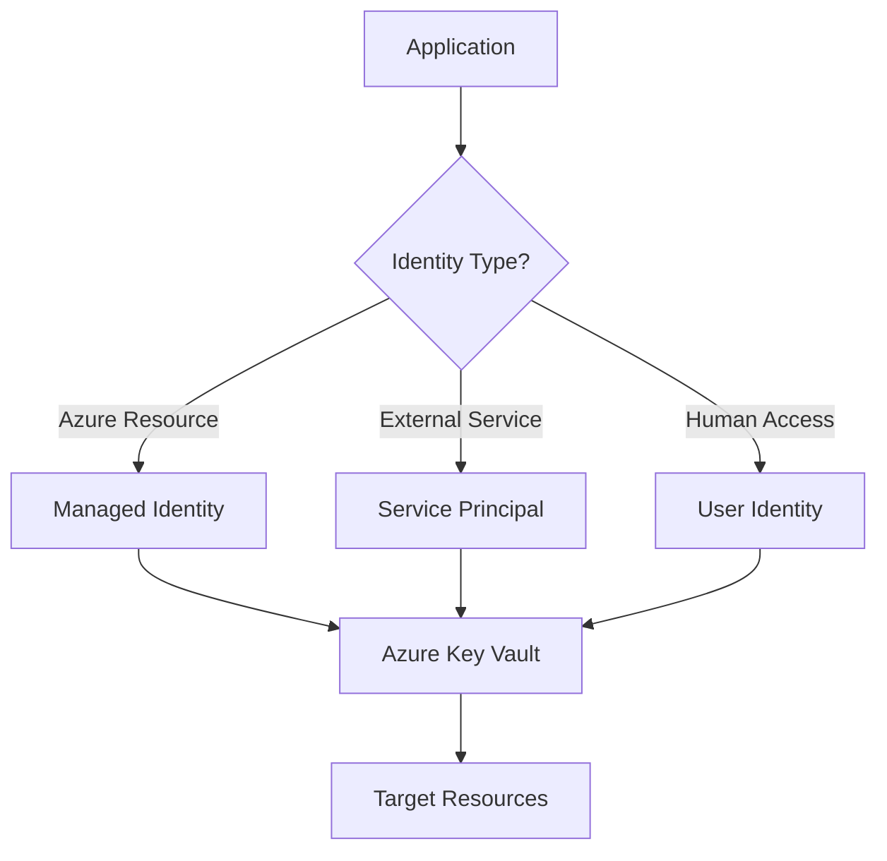

# Understanding Azure Identity Types: A Complete Guide

Azure provides several identity types for different authentication and authorization scenarios. Understanding when and how to use each type is crucial for building secure, scalable cloud applications.

## Overview of Azure Identity Types

Azure supports three main identity types:

1. **User Identities** - Human users in Azure AD
2. **Service Principals** - Application identities  
3. **Managed Identities** - Azure-managed service identities

## User Identities

User identities represent actual people who need access to Azure resources. These are traditional user accounts stored in Azure Active Directory.

### Key Characteristics:
- Require username/password or multi-factor authentication
- Can be assigned roles and permissions
- Support conditional access policies
- Ideal for interactive scenarios

### Use Cases:
- Developers accessing Azure Portal
- End users accessing applications
- Administrative access to resources

## Service Principals

Service Principals are non-human identities used by applications, services, and automation tools.

### Creating a Service Principal

```bash
# Create service principal with contributor role
az ad sp create-for-rbac --name "myapp-sp" \
  --role contributor \
  --scopes /subscriptions/{subscription-id}/resourceGroups/{resource-group}
```

### Key Benefits:
- **Programmatic Access**: Enable applications to authenticate without user intervention
- **Fine-grained Permissions**: Assign specific roles and scopes
- **Certificate-based Auth**: Support both password and certificate authentication
- **Cross-tenant Access**: Can access resources across different tenants

### Use Cases:
- CI/CD pipelines
- Application authentication
- Third-party integrations
- Automation scripts

## Managed Identities

Managed Identities eliminate the need to manage credentials in your code by providing an automatically managed identity in Azure AD.

### System-Assigned Managed Identity

```bash
# Enable system-assigned managed identity for VM
az vm identity assign --name myVM --resource-group myResourceGroup
```

### User-Assigned Managed Identity

```bash
# Create user-assigned managed identity
az identity create --name myUserAssignedIdentity --resource-group myResourceGroup

# Assign to VM
az vm identity assign --name myVM \
  --resource-group myResourceGroup \
  --identities myUserAssignedIdentity
```

## Comparison Matrix

| Feature | User Identity | Service Principal | Managed Identity |
|---------|---------------|------------------|------------------|
| **Human Interactive** | ✅ Yes | ❌ No | ❌ No |
| **Credential Management** | Manual | Manual | Automatic |
| **Azure Resource Access** | ✅ Yes | ✅ Yes | ✅ Yes |
| **Cross-tenant Access** | ✅ Yes | ✅ Yes | ❌ No |
| **Lifecycle Management** | Manual | Manual | Automatic |

## Best Practices

### Security Recommendations

1. **Use Managed Identities** when possible for Azure resources
2. **Implement least privilege** - assign minimum required permissions
3. **Regular rotation** of Service Principal secrets
4. **Monitor authentication** logs for suspicious activity

### Architectural Patterns



## Implementation Examples

### Using Managed Identity in Code

```python
from azure.identity import ManagedIdentityCredential
from azure.keyvault.secrets import SecretClient

# Create credential using managed identity
credential = ManagedIdentityCredential()

# Access Key Vault
client = SecretClient(vault_url="https://vault.vault.azure.net/", credential=credential)
secret = client.get_secret("database-connection-string")
```

### Service Principal Authentication

```python
from azure.identity import ClientSecretCredential

credential = ClientSecretCredential(
    tenant_id="your-tenant-id",
    client_id="your-client-id", 
    client_secret="your-client-secret"
)
```

## Terraform Configuration

```hcl
# Service Principal
resource "azuread_application" "main" {
  display_name = "myapp"
}

resource "azuread_service_principal" "main" {
  application_id = azuread_application.main.application_id
}

# Managed Identity
resource "azurerm_user_assigned_identity" "main" {
  name                = "myapp-identity"
  location            = azurerm_resource_group.main.location
  resource_group_name = azurerm_resource_group.main.name
}

# Role Assignment
resource "azurerm_role_assignment" "main" {
  scope                = azurerm_resource_group.main.id
  role_definition_name = "Contributor"
  principal_id         = azurerm_user_assigned_identity.main.principal_id
}
```

## Monitoring and Troubleshooting

### Common Issues

1. **Permission Denied**: Check role assignments and scopes
2. **Authentication Failures**: Verify credentials and token expiration
3. **Cross-tenant Issues**: Ensure proper guest access configuration

### Monitoring Tools

- **Azure AD Sign-in Logs**: Track authentication events
- **Azure Activity Logs**: Monitor resource access
- **Application Insights**: Application-level monitoring

## Conclusion

Choosing the right Azure identity type depends on your specific use case:

- **User Identities** for human interactive access
- **Service Principals** for applications and cross-tenant scenarios  
- **Managed Identities** for Azure resources (preferred when available)

By understanding these identity types and following security best practices, you can build robust, secure Azure solutions that properly manage authentication and authorization across your cloud infrastructure.