# Azure Landing Zones: Subscription Strategy and Management Best Practices

## Executive Summary

**Bottom Line Up Front:** Subscriptions serve as the fundamental isolation and management boundary in Azure Landing Zones, providing superior environment separation compared to management groups while enabling scalable governance through subscription vending mechanisms. This approach aligns with Microsoft's Cloud Adoption Framework (CAF) and Well-Architected Framework (WAF) principles to deliver secure, compliant, and operationally efficient cloud environments.

## Complete Azure Landing Zone Architecture Overview

The following diagram illustrates the complete Azure Landing Zone architecture, showing the relationship between management groups, subscriptions, and resource groups, along with policy inheritance, network connectivity, and billing boundaries:

```mermaid
graph TB
    %% Management Group Hierarchy
    Root[("🏢 Root Management Group<br/>Contoso Corp")]
    
    Platform["🏗️ Platform<br/>Management Group"]
    LandingZones["🎯 Landing Zones<br/>Management Group"]
    Decommissioned["🗑️ Decommissioned<br/>Management Group"]
    Sandboxes["🧪 Sandboxes<br/>Management Group"]
    
    %% Platform Subscriptions
    Identity["🔐 Identity<br/>Subscription<br/>💰 Billing: IT-Security"]
    Management["📊 Management<br/>Subscription<br/>💰 Billing: IT-Operations"]
    Connectivity["🌐 Connectivity<br/>Subscription<br/>💰 Billing: IT-Network"]
    
    %% Landing Zone Subscriptions
    ProdOnline["🏪 Production Online<br/>Subscription<br/>💰 Billing: Business-Unit-A"]
    ProdCorp["🏢 Production Corporate<br/>Subscription<br/>💰 Billing: Business-Unit-B"]
    DevTest["🔧 Dev/Test<br/>Subscription<br/>💰 Billing: Development"]
    
    %% Sandbox Subscriptions
    Sandbox1["🏖️ Developer Sandbox 1<br/>Subscription<br/>💰 Billing: Individual-Dev"]
    Sandbox2["🏖️ Developer Sandbox 2<br/>Subscription<br/>💰 Billing: Individual-Dev"]
    
    %% Decommissioned
    OldSub["⚰️ Legacy Application<br/>Subscription (Archived)<br/>💰 Billing: Archived"]
    
    %% Management Group Relationships
    Root --> Platform
    Root --> LandingZones
    Root --> Decommissioned
    Root --> Sandboxes
    
    %% Platform Subscriptions
    Platform --> Identity
    Platform --> Management
    Platform --> Connectivity
    
    %% Landing Zone Subscriptions
    LandingZones --> ProdOnline
    LandingZones --> ProdCorp
    LandingZones --> DevTest
    
    %% Sandbox Subscriptions
    Sandboxes --> Sandbox1
    Sandboxes --> Sandbox2
    
    %% Decommissioned
    Decommissioned --> OldSub
    
    %% Resource Groups within Subscriptions
    subgraph Identity_Sub ["🔐 Identity Subscription"]
        Identity_RG1["👥 Azure AD Connect<br/>Resource Group"]
        Identity_RG2["🔒 Privileged Identity<br/>Resource Group"]
        Identity_RG3["📝 Identity Governance<br/>Resource Group"]
    end
    
    subgraph Connectivity_Sub ["🌐 Connectivity Subscription"]
        Conn_RG1["🌍 Hub Virtual Network<br/>Resource Group"]
        Conn_RG2["🔗 ExpressRoute Gateway<br/>Resource Group"]
        Conn_RG3["🛡️ Azure Firewall<br/>Resource Group"]
        Conn_RG4["📡 DNS Private Zones<br/>Resource Group"]
    end
    
    subgraph ProdOnline_Sub ["🏪 Production Online Subscription"]
        Prod_RG1["🖥️ Web Tier<br/>Resource Group"]
        Prod_RG2["⚙️ Application Tier<br/>Resource Group"]
        Prod_RG3["🗄️ Database Tier<br/>Resource Group"]
        Prod_RG4["📊 Monitoring<br/>Resource Group"]
    end
    
    subgraph DevTest_Sub ["🔧 Dev/Test Subscription"]
        Dev_RG1["🧪 Development Environment<br/>Resource Group"]
        Dev_RG2["🎭 Testing Environment<br/>Resource Group"]
        Dev_RG3["🔄 CI/CD Pipeline<br/>Resource Group"]
    end
    
    %% Network Connectivity Lines (Hub-Spoke)
    Conn_RG1 -.->|"VNet Peering"| Prod_RG1
    Conn_RG1 -.->|"VNet Peering"| Dev_RG1
    Conn_RG1 -.->|"VNet Peering"| Identity_RG1
    
    %% Policy Inheritance Arrows
    Root ===>|"Org Policies"| Platform
    Root ===>|"Org Policies"| LandingZones
    Root ===>|"Org Policies"| Sandboxes
    
    Platform ===>|"Platform Policies"| Identity
    Platform ===>|"Platform Policies"| Management
    Platform ===>|"Platform Policies"| Connectivity
    
    LandingZones ===>|"Landing Zone Policies"| ProdOnline
    LandingZones ===>|"Landing Zone Policies"| ProdCorp
    LandingZones ===>|"Landing Zone Policies"| DevTest
    
    %% Legend
    subgraph Legend ["📋 Legend"]
        L1["🏢 Management Group"]
        L2["📦 Subscription"]
        L3["📁 Resource Group"]
        L4["💰 Billing Boundary"]
        L5["====> Policy Inheritance"]
        L6["-.--> Network Connectivity"]
    end
    
    %% Styling
    classDef mgmtGroup fill:#e8f5e8,stroke:#2e7d32,stroke-width:3px,color:#1b5e20
    classDef subscription fill:#e3f2fd,stroke:#1565c0,stroke-width:2px,color:#0d47a1
    classDef resourceGroup fill:#fce4ec,stroke:#c2185b,stroke-width:1px,color:#880e4f
    classDef platform fill:#fff3e0,stroke:#ef6c00,stroke-width:2px,color:#e65100
    classDef landingzone fill:#f1f8e9,stroke:#558b2f,stroke-width:2px,color:#33691e
    classDef sandbox fill:#f3e5f5,stroke:#7b1fa2,stroke-width:2px,color:#4a148c
    classDef decom fill:#fafafa,stroke:#616161,stroke-width:2px,color:#212121
    classDef legend fill:#fff8e1,stroke:#ffa000,stroke-width:1px,color:#ff6f00
    
    class Root,Platform,LandingZones,Decommissioned,Sandboxes mgmtGroup
    class Identity,Management,Connectivity platform
    class ProdOnline,ProdCorp,DevTest landingzone
    class Sandbox1,Sandbox2 sandbox
    class OldSub decom
    class Identity_RG1,Identity_RG2,Identity_RG3,Conn_RG1,Conn_RG2,Conn_RG3,Conn_RG4,Prod_RG1,Prod_RG2,Prod_RG3,Prod_RG4,Dev_RG1,Dev_RG2,Dev_RG3 resourceGroup
    class Legend,L1,L2,L3,L4,L5,L6 legend
```



This comprehensive diagram demonstrates several key architectural principles:

**Hierarchical Organization**: Management groups represent **organizational or application archetypes** (Corp, Online, Platform), NOT environments. Environment separation (Production, Test, Development) happens at the subscription level.

**Subscription Boundaries**: Each environment within an application archetype gets its own subscription, providing complete isolation between dev, test, and production workloads.

**Resource Group Granularity**: Within subscriptions, resource groups organize resources by application tier, lifecycle, or functional responsibility.

**Network Connectivity**: The hub-and-spoke model shows how the Connectivity subscription provides centralized networking services to all landing zone subscriptions.

**Policy Inheritance**: Bold arrows show how policies cascade from organizational structure (management groups) to individual environment subscriptions.

**Environment Isolation**: Notice how Corp has separate subscriptions for Production, Test, and Development - this is the correct approach per Microsoft CAF guidance.

## Understanding Azure Landing Zones Foundation

Azure Landing Zones represent the architectural foundation for enterprise-scale cloud adoption, providing a standardized approach to deploying and managing Azure environments. Within this framework, **subscriptions emerge as the cornerstone for environment isolation** rather than relying solely on management groups or resource-level boundaries.

The subscription-centric approach aligns with Microsoft's CAF principles by establishing clear ownership models, simplified governance structures, and natural cost management boundaries. This strategy recognizes that subscriptions provide the most granular level of Azure billing, policy enforcement, and access control that can be effectively managed at scale.

## The Subscription as the Primary Isolation Boundary

### Why Subscriptions Trump Management Groups for Environment Separation

**Subscriptions provide superior isolation characteristics** that management groups cannot match:

**Billing Isolation**: Each subscription maintains its own billing boundary, enabling precise cost allocation and chargeback mechanisms. Management groups, while useful for policy inheritance, do not provide this granular financial separation that enterprises require for accurate cost accounting across environments.

**Policy Enforcement**: Azure Policy operates most effectively at the subscription level, where policies can be enforced with complete isolation from other environments. While management groups enable policy inheritance, subscription-level enforcement ensures that development environment policies cannot interfere with production workloads.

**Access Control Precision**: Role-Based Access Control (RBAC) at the subscription level provides clear security boundaries. A developer granted access to a development subscription cannot accidentally access production resources, even if management group structures change.

**Resource Limits and Quotas**: Azure enforces many service limits at the subscription level, providing natural resource consumption boundaries that prevent environment sprawl and resource exhaustion scenarios.

## Subscription Vending: Enabling Scalable Governance

### The Subscription Vending Concept

Subscription vending represents an automated approach to subscription lifecycle management, treating subscriptions as consumable resources that can be provisioned, configured, and decommissioned through standardized processes. This concept transforms subscription management from a manual, error-prone process into a scalable, repeatable operation.

**Core Components of Subscription Vending:**

**Automated Provisioning**: Infrastructure-as-Code (IaC) templates automatically create new subscriptions with pre-configured governance policies, networking configurations, and security baselines. This ensures consistency across all environments while reducing deployment time from weeks to minutes.

**Standardized Configuration**: Each vended subscription receives a consistent set of configurations including Azure Policy assignments, networking connectivity to hub infrastructure, monitoring and logging configurations, and security baseline implementations.

**Lifecycle Management**: Subscription vending includes decommissioning processes that safely remove unused subscriptions while preserving audit trails and ensuring compliance with data retention requirements.

### Implementation Architecture

**Hub-and-Spoke Network Integration**: Vended subscriptions automatically connect to centralized hub infrastructure, inheriting DNS configurations, security monitoring, and connectivity to on-premises resources through ExpressRoute or VPN connections.

**Policy Inheritance and Customization**: While inheriting organizational policies from management groups, each subscription can receive environment-specific policy configurations through the vending process, ensuring appropriate governance without manual intervention.

**Identity Integration**: Automated integration with Azure Active Directory ensures that newly vended subscriptions receive appropriate access controls, service principals, and managed identities aligned with organizational security standards.

## Alignment with WAF and CAF Principles

### Well-Architected Framework Integration

**Security Pillar Alignment**: Subscription-based isolation supports the WAF Security pillar by providing clear trust boundaries, enabling defense-in-depth strategies, and simplifying security monitoring through subscription-level logging and alerting.

**Reliability Enhancement**: The subscription model supports the Reliability pillar by preventing cross-environment resource dependencies that could cascade failures between development, staging, and production workloads.

**Performance Efficiency**: Subscription boundaries prevent resource contention between environments, ensuring that performance testing in development subscriptions cannot impact production workload performance.

**Cost Optimization**: Direct alignment with Azure billing enables precise cost tracking and optimization strategies, supporting the Cost Optimization pillar through clear financial boundaries and chargeback mechanisms.

**Operational Excellence**: Standardized subscription configurations through vending processes support the Operational Excellence pillar by reducing configuration drift and enabling consistent operational procedures across environments.

### Cloud Adoption Framework Synergy

**Governance Discipline**: The subscription model directly supports CAF governance disciplines by providing clear policy enforcement boundaries and enabling graduated access controls based on environment maturity.

**Security Baseline**: Subscription-level security configurations ensure consistent security baselines while allowing environment-specific adjustments that don't compromise overall security posture.

**Identity Baseline**: Clear subscription boundaries simplify identity management by providing discrete scopes for access control and reducing the complexity of cross-environment permission scenarios.

## Benefits and Business Value

### Operational Benefits

**Simplified Blast Radius Management**: Issues within one subscription cannot directly impact resources in other subscriptions, containing problems within natural boundaries and simplifying troubleshooting procedures.

**Enhanced Compliance Posture**: Subscription-level isolation simplifies compliance auditing by providing clear scopes for regulatory requirements. Different environments can maintain different compliance postures without complex policy interactions.

**Streamlined Cost Management**: Direct correlation between subscriptions and cost centers enables accurate chargeback mechanisms and simplifies budget allocation and tracking across organizational units.

### Strategic Advantages

**Scalability Without Complexity**: As organizations grow, new subscriptions can be vended automatically without restructuring existing environments or complex policy inheritance scenarios.

**Risk Mitigation**: The subscription boundary provides inherent risk mitigation by preventing accidental cross-environment impacts and enabling environment-specific security configurations.

**Innovation Enablement**: Development teams can receive dedicated subscriptions that provide full Azure functionality without impacting production environments, accelerating innovation cycles and reducing time-to-market.

## Implementation Guardrails and Best Practices

### Architectural Standards

**Subscription Taxonomy**: Establish clear naming conventions and tagging strategies that identify subscription purpose, environment type, cost center, and lifecycle stage. This taxonomy becomes critical for automation and governance processes.

**Network Design Consistency**: All vended subscriptions should follow consistent network design patterns, connecting to centralized hub infrastructure while maintaining appropriate network segmentation based on environment sensitivity.

**Security Configuration Baseline**: Define and implement consistent security baselines that can be applied automatically during subscription vending, including Azure Security Center configurations, logging requirements, and incident response procedures.

### Governance Implementation

**Policy Strategy**: Implement layered policy strategies that combine organization-wide policies applied through management groups with environment-specific policies applied at subscription provisioning time.

**Monitoring and Alerting**: Establish subscription-level monitoring that provides both environment-specific visibility and organization-wide aggregation for compliance and operational oversight.

**Change Management**: Implement change management processes that account for subscription-level changes while maintaining consistency with organizational standards and security requirements.

## Decision Framework: Subscription vs Resource Group vs Management Group

### The Three-Layer Decision Matrix

**Management Groups**: Use for organizational hierarchy and policy inheritance across multiple subscriptions
**Subscriptions**: Use for environment isolation and billing boundaries  
**Resource Groups**: Use for resource lifecycle management and deployment boundaries

### When to Use Subscriptions

**Primary Decision Criteria:**

**Environment Separation Requirements**: Create separate subscriptions when you need complete isolation between environments (dev, test, staging, prod). This prevents any cross-environment resource dependencies or access bleeding.

**Billing and Cost Allocation**: Use subscriptions when you need separate billing boundaries for different cost centers, projects, or departments. Each subscription provides its own invoice and spending limits.

**Compliance and Regulatory Boundaries**: Different compliance requirements (PCI-DSS, HIPAA, SOX) warrant separate subscriptions to maintain audit trails and policy enforcement isolation.

**Blast Radius Control**: When failures in one environment absolutely cannot impact another, subscriptions provide the strongest isolation boundary.

**Different SLA Requirements**: Production workloads requiring 99.99% availability should be isolated from development environments that may have planned downtime.

**Geographic or Legal Entity Separation**: Different countries, legal entities, or data sovereignty requirements typically require separate subscriptions.

### When to Use Resource Groups Instead

**Resource Groups are appropriate when:**

**Shared Lifecycle Management**: Resources that are deployed, updated, and deleted together should share a resource group. Think of a three-tier application where the web servers, application servers, and databases have the same lifecycle.

**Same Environment, Different Applications**: Multiple applications within the same environment (e.g., both running in production) can use different resource groups while sharing the same subscription's policies and billing.

**Granular RBAC Within Environment**: When you need different access permissions for different application components within the same environment, resource groups provide sufficient isolation.

**Shared Networking and Infrastructure**: Applications that share virtual networks, DNS zones, or other infrastructure components should typically remain in the same subscription but use separate resource groups.

**Cost Tracking at Application Level**: While subscriptions provide billing boundaries, resource groups with proper tagging can provide cost allocation within a subscription.

### When to Use Management Groups

**Management Groups serve as:**

**Policy Inheritance Hierarchy**: Apply common policies across multiple subscriptions (security baselines, naming conventions, required tags).

**Organizational Structure Representation**: Mirror your organization's business units, departments, or geographical divisions for policy and access management.

**Bulk Operations Scope**: When you need to apply changes across multiple subscriptions simultaneously.

**Compliance Scope Definition**: Group subscriptions that share the same compliance requirements for easier audit management.

### Decision Tree Framework


### Practical Examples

**Subscription-Level Separation:**
- Production vs Development environments
- Different business units or subsidiaries
- Customer-facing vs internal applications
- Different geographic regions with data residency requirements
- Third-party managed services vs internal workloads

**Resource Group-Level Separation:**
- Frontend vs backend components of same application
- Different microservices within same environment
- Database tier vs application tier
- Monitoring resources vs application resources
- Temporary vs permanent resources with different lifecycles

**Management Group-Level Organization:**
- Business units (Sales, Marketing, Engineering)
- Geographic divisions (North America, Europe, Asia)
- Application archetypes (Corp applications, Online applications, Partner applications)
- Compliance scopes (PCI workloads, HIPAA workloads)

### Anti-Patterns to Avoid

**Don't Use Subscriptions For:**
- Fine-grained access control that can be achieved with resource groups
- Temporary resource separation that doesn't need billing isolation
- Organizational convenience without technical justification
- Every small project or application

**Don't Use Resource Groups For:**
- Different environments that need policy isolation
- Separate billing requirements
- Different compliance boundaries
- Cross-application shared infrastructure

**Don't Use Management Groups For:**
- Environment separation (dev, test, prod) - use subscriptions instead
- Direct resource deployment
- Billing separation
- Runtime isolation between workloads
- Individual project organization

### Scale Considerations

**Small Organizations (< 50 resources):**
- Single subscription with multiple resource groups
- Management groups may be overkill

**Medium Organizations (50-500 resources):**
- Environment-based subscriptions (dev, test, prod)
- Application-based resource groups
- Simple management group structure

**Large Organizations (500+ resources):**
- Business unit and environment-based subscriptions
- Fine-grained resource group strategy
- Complex management group hierarchies for policy inheritance

## Technical Implementation Framework

### Subscription Vending Pipeline

```yaml
# Example subscription vending workflow
subscription_vending_process:
  - name: "Request Validation"
    actions:
      - validate_business_justification
      - verify_approvals
      - check_naming_conventions
  
  - name: "Subscription Creation"
    actions:
      - create_azure_subscription
      - apply_base_configuration
      - establish_network_connectivity
  
  - name: "Governance Application"
    actions:
      - apply_policy_assignments
      - configure_rbac_permissions
      - enable_monitoring_and_logging
  
  - name: "Integration and Testing"
    actions:
      - validate_connectivity
      - test_security_controls
      - verify_compliance_posture
```

### Key Metrics and KPIs

**Operational Metrics:**
- Subscription provisioning time (target: <2 hours automated)
- Configuration drift incidents (target: <1% monthly)
- Policy compliance percentage (target: >99%)
- Cost allocation accuracy (target: >95%)

**Strategic Metrics:**
- Time-to-productivity for new projects (reduction target: 70%)
- Security incident containment effectiveness
- Compliance audit preparation time (reduction target: 80%)
- Infrastructure-as-Code coverage (target: >95%)

## Conclusion

The subscription-centric approach to Azure Landing Zones represents a mature, scalable strategy that aligns with both Microsoft's architectural guidance and enterprise operational requirements. By treating subscriptions as the primary environment boundary and implementing subscription vending capabilities, organizations can achieve the governance, security, and operational benefits necessary for successful cloud adoption at scale.

This approach provides clear separation of concerns, simplified operational models, and natural scaling characteristics that support long-term cloud strategy objectives while maintaining the flexibility to adapt to changing business requirements. The integration with WAF and CAF principles ensures that this architectural approach supports broader cloud adoption goals while providing the technical foundation for secure, reliable, and cost-effective cloud operations.

---

*This document serves as the definitive guardrail for organizations implementing Azure Landing Zones with subscription-centric architecture, ensuring consistency, security, and operational excellence across all cloud environments.*