# Azure Routing Rules in Hybrid Environments: A Complete Guide

In my experience working with Azure networking, I've noticed that routing confusion often stems from overlooking the "invisible" components - the default routes that don't appear explicitly in our configurations and the routing rules configured in local network gateways. This comprehensive guide explains Azure's routing precedence and how these hidden elements affect traffic flow in hybrid environments.

## Azure Routing Precedence Order

Azure follows a specific priority order when multiple routes contain the same address prefix. The selection is based on route type priority, not the longest prefix match algorithm which is used first:

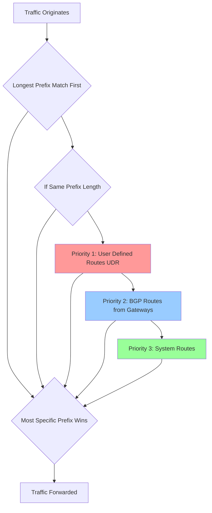

**Important**: Azure first uses the longest prefix match algorithm, then applies route type priority only when multiple routes have the same address prefix.

## Understanding Route Selection Priority

When multiple routes contain the same address prefix, Azure selects the route type based on the following priority:

1. User-defined route
2. BGP route
3. System route

**Critical Exception - System Route Preference**: System routes for traffic related to virtual network, virtual network peerings, or virtual network service endpoints are preferred routes, even if BGP routes are more specific.

## System Route Exception Explained

This exception exists to ensure Azure's core networking functions remain reliable and predictable. Here's what this means in practice:

### Scenario 1: VNet Peering vs BGP Routes

```mermaid
graph TB
    subgraph "Hub VNet: 10.0.0.0/16"
        Hub[Hub Resources]
        ERGW[ExpressRoute Gateway]
    end
    
    subgraph "Spoke VNet: 10.1.0.0/16"  
        Spoke[Spoke Resources]
    end
    
    subgraph "On-Premises"
        OnPrem[10.1.5.0/24<br/>Advertised via BGP]
    end
    
    Hub <--> |Peering<br/>System Route: 10.1.0.0/16| Spoke
    OnPrem --> |BGP Route: 10.1.5.0/24<br/>(More Specific!)| ERGW
    ERGW --> Hub
    
    style Spoke fill:#99ff99
    style OnPrem fill:#ffcc99
```

**Result**: Traffic from Hub to 10.1.5.100 will use the VNet peering system route (10.1.0.0/16), not the more specific BGP route (10.1.5.0/24) from on-premises.

**Why**: Azure prioritizes VNet connectivity over external routing to prevent breaking internal communication.

### Scenario 2: Service Endpoints vs BGP Routes

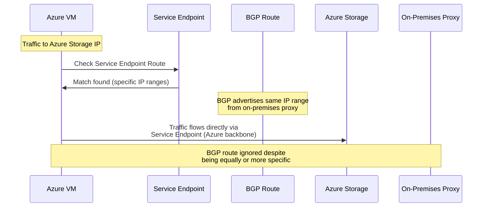

**Result**: Service endpoint system routes always take precedence over BGP routes for Azure service traffic, ensuring security and performance.

### Scenario 3: Connected Subnets vs BGP Routes

```bash
# Example: VNet with 10.0.0.0/16 address space
# Subnet A: 10.0.1.0/24
# Subnet B: 10.0.2.0/24

# On-premises advertises specific route via BGP:
# 10.0.2.0/24 → On-premises proxy/firewall
System Route: 10.0.2.0/24 → VNetLocal (automatic, invisible)
BGP Route: 10.0.2.0/24 → Virtual Network Gateway (advertised from on-premises)
```

**Result**: Intra-VNet traffic between subnets will use the system route, ignoring the BGP route entirely.

## Real-World Impact Examples

### Example 1: Hub-and-Spoke Connectivity Issues

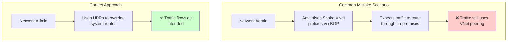

**Problem**: Advertising 10.1.0.0/16 (spoke VNet range) via BGP won't work because the VNet peering system route takes precedence.

**Solution**: Use UDRs to explicitly override the system routes.

### Example 2: Service Endpoint Confusion

```yaml
# Common misconception
Scenario: "I'll route storage traffic through my firewall using BGP"
BGP_Route: "Storage_IP_Range → On-premises_Firewall" 
Service_Endpoint: "Enabled for Azure Storage"

# Actual behavior
Result: "Service endpoint system route wins"
Traffic_Flow: "VM → Azure Storage (direct, bypassing firewall)"
Admin_Confusion: "Why isn't my firewall seeing storage traffic?"
```

## When System Route Exception Does NOT Apply

The system route preference exception only applies to specific route types:

| System Route Type | Exception Applies | Example |
|---|---|---|
| VNet address space | ✅ Yes | 10.0.0.0/16 → VNetLocal |
| Connected subnets | ✅ Yes | 10.0.1.0/24 → VNetLocal |
| VNet peering | ✅ Yes | 10.1.0.0/16 → VNet Peering |
| Service endpoints | ✅ Yes | Storage IPs → Service Endpoint |
| Default internet route | ❌ No | 0.0.0.0/0 → Internet |
| Reserved IP ranges | ❌ No | 10.0.0.0/8 → None |

## Debugging System Route Exceptions

```bash
# Check effective routes to see what's actually happening
az network nic show-effective-route-table \
    --resource-group myResourceGroup \
    --name myVMNic

# Look for routes with these sources:
# - "Default" with "VirtualNetworkPeering" next hop
# - "Default" with "VirtualNetworkServiceEndpoint" next hop  
# - "Default" with "VnetLocal" next hop
```

Key indicators in effective routes:
- **Source**: "Default"
- **Next hop type**: "VirtualNetworkPeering", "VnetLocal", or "VirtualNetworkServiceEndpoint"
- **State**: "Active" (even when more specific BGP routes exist)

## Override Strategies

If you need to override these system route preferences:

```bash
# Option 1: Use more specific UDRs
az network route-table route create \
    --resource-group myResourceGroup \
    --route-table-name myRouteTable \
    --name OverrideSystemRoute \
    --address-prefix 10.1.5.0/24 \
    --next-hop-type VirtualAppliance \
    --next-hop-ip-address 10.0.100.4

# Option 2: Disable service endpoints if overriding storage routes
az network vnet subnet update \
    --resource-group myResourceGroup \
    --vnet-name myVNet \
    --name mySubnet \
    --service-endpoints ""
```

This system route exception is one of the most misunderstood aspects of Azure networking and often causes confusion in hybrid environments where admins expect BGP routes to override all Azure behavior.

## 1. User Defined Routes (UDR) - Highest Priority

**What it is**: Custom routes you explicitly create and associate with subnets.

**Priority**: Highest (overrides all other routes)

**Use cases**:
- Force traffic through Network Virtual Appliances (NVAs)
- Override default Azure routing behavior
- Implement custom routing policies
- Traffic inspection requirements

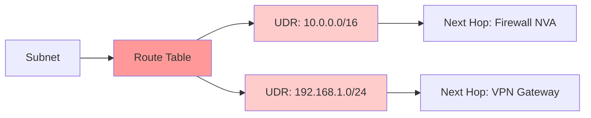

### Example Scenario: Forcing Traffic Through Firewall

```bash
# Azure CLI example for UDR
az network route-table create \
    --resource-group myResourceGroup \
    --name myRouteTable

az network route create \
    --resource-group myResourceGroup \
    --route-table-name myRouteTable \
    --name ToOnPremises \
    --address-prefix 192.168.0.0/16 \
    --next-hop-type VirtualAppliance \
    --next-hop-ip-address 10.0.1.4

# Associate with subnet
az network vnet subnet update \
    --vnet-name myVNet \
    --name mySubnet \
    --resource-group myResourceGroup \
    --route-table myRouteTable
```

## 2. BGP Routes from Gateways - Second Priority (When Same Prefix)

**What it is**: Routes learned via BGP from VPN Gateways, ExpressRoute, or Virtual Network Gateways.

**Priority**: Second highest when routes have identical prefixes

**Sources**:
- ExpressRoute circuits
- Site-to-Site VPN connections
- Virtual Network Gateways with BGP enabled
- Local Network Gateway routing rules (often forgotten!)

**Key Insight**: BGP routes can be more specific (longer prefix) than system routes and will take precedence due to longest prefix match, regardless of route type priority.

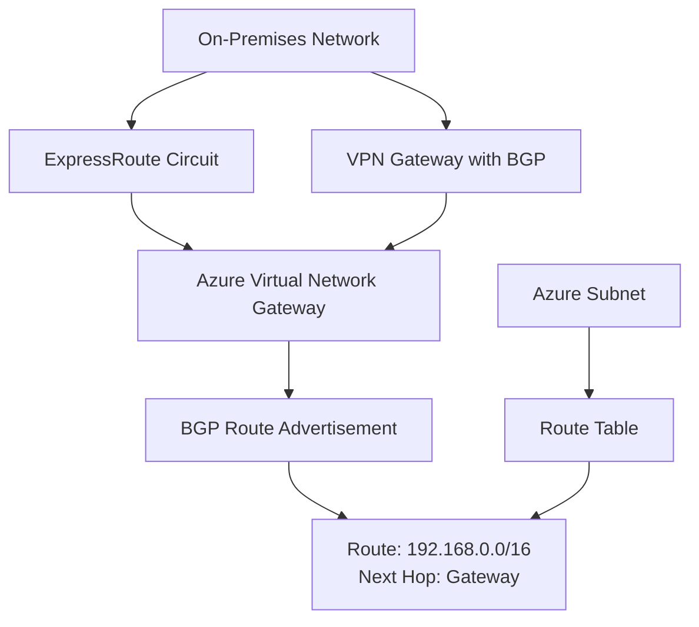

## 3. System Routes - Third Priority (When Same Prefix)

**What it is**: Default routes automatically created by Azure for VNet communication.

**Priority**: Third when routes have identical prefixes (but often most specific!)

**Includes**:
- VNet address space routes
- Connected subnet routes  
- VNet peering routes
- Service endpoint routes
- **The "invisible" routes that don't show in your configuration**

**Special Behavior**: System routes for traffic related to virtual network, virtual network peerings, or virtual network service endpoints are preferred routes, even if BGP routes are more specific.

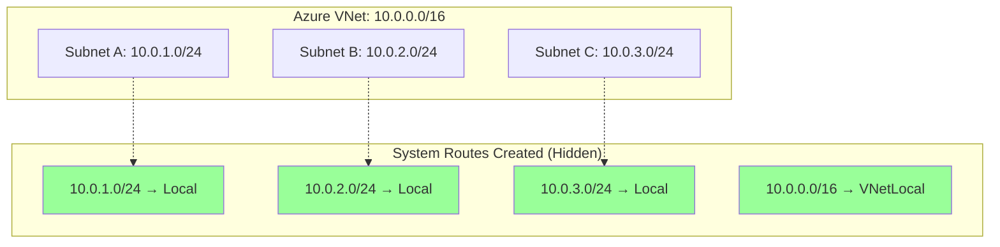

### BGP Route Propagation Behavior

**ExpressRoute vs VPN Priority**: When the same route is advertised via both ExpressRoute and VPN:
1. ExpressRoute takes precedence (lower AS path)
2. VPN becomes backup path
3. Automatic failover occurs if ExpressRoute fails

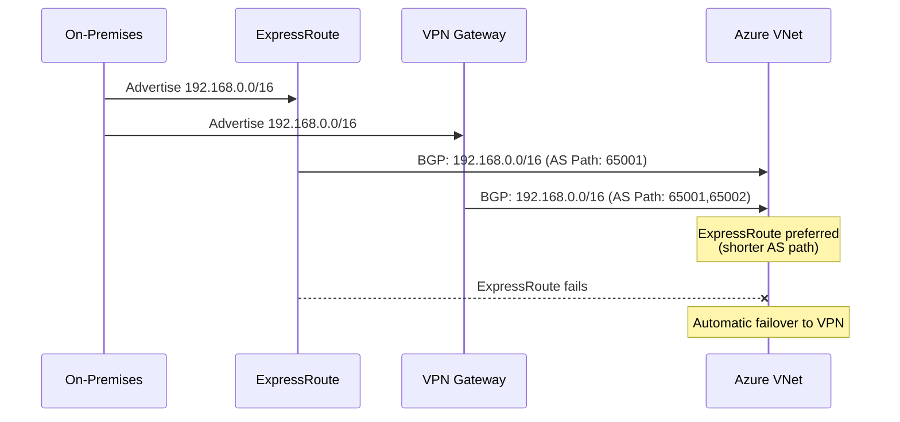

## 4. Default Route (0.0.0.0/0) - Lowest Priority

**What it is**: Azure's default internet route.

**Priority**: Lowest (used when no other route matches)

**Behavior**:
- Routes to Azure's internet edge
- Can be overridden by UDR with 0.0.0.0/0

## Complete Hybrid Routing Flow

Here's the accurate routing decision process in Azure:

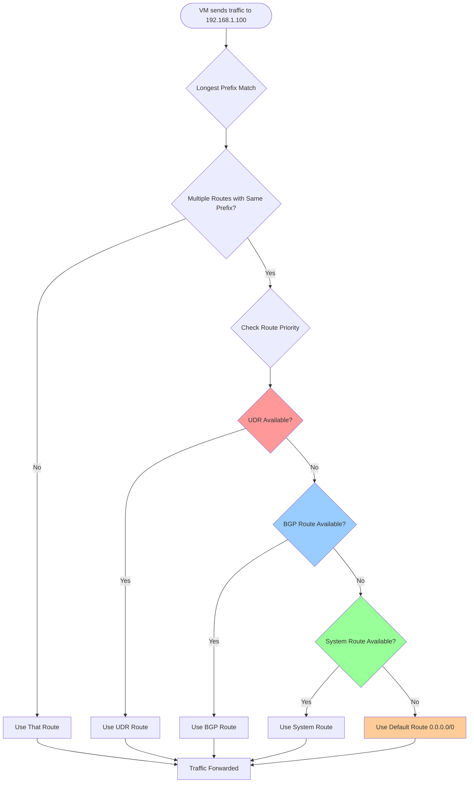

## Hybrid Environment Routing Scenarios

### Scenario 1: Hub-and-Spoke with NVA

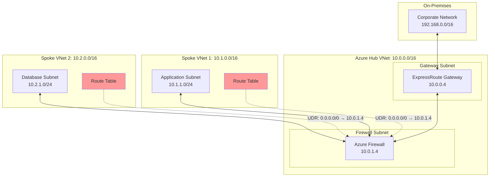

**Routing Rules Applied**:
- **UDR**: 0.0.0.0/0 → Azure Firewall (10.0.1.4) - Highest priority when same prefix
- **System Routes**: 10.1.0.0/16, 10.2.0.0/16 → VNet Local (invisible but present!)
- **BGP**: 192.168.0.0/16 → ExpressRoute Gateway - Second priority when same prefix

**Note**: A /24 BGP route will always beat a /16 system route due to longest prefix match, regardless of route type priority.

## Advanced Routing Scenarios

### Route Propagation and Gateway Subnet

You can disable ExpressRoute and Azure VPN Gateway route propagation on a subnet by using a property on a route table. This is critical for controlling BGP route advertisements.

**Important**: Route propagation shouldn't be disabled on GatewaySubnet. If this setting is disabled, the gateway doesn't function.

```bash
# Disable BGP route propagation
az network route-table update \
    --resource-group myResourceGroup \
    --name myRouteTable \
    --disable-bgp-route-propagation true
```

### Service Tags in User-Defined Routes

You can now specify a service tag as the address prefix for a UDR instead of an explicit IP range. This is powerful for routing traffic to specific Azure services.

```bash
# Route storage traffic through NVA using service tags
az network route-table route create \
    --resource-group myResourceGroup \
    --route-table-name myRouteTable \
    --name StorageRoute \
    --address-prefix Storage.EastUS \
    --next-hop-type VirtualAppliance \
    --next-hop-ip-address 10.0.100.4
```

### 0.0.0.0/0 Route Behavior

When you override the 0.0.0.0/0 address prefix, outbound traffic from the subnet flows through the virtual network gateway or virtual appliance. This has several implications:

- Azure sends all traffic to the next hop type specified in the route, including traffic destined for public IP addresses of Azure services
- You can no longer directly access resources in the subnet from the internet

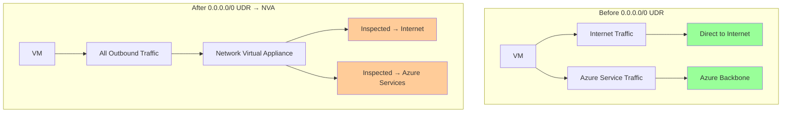

### Multi-Path Routing Example

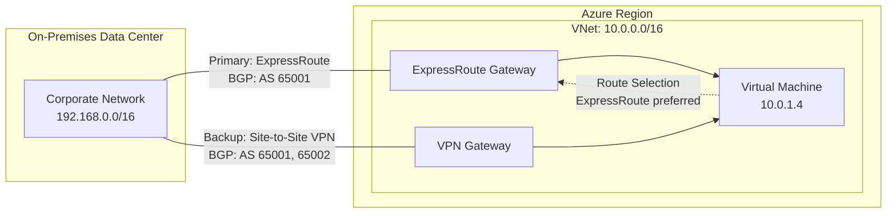

## Troubleshooting Routing Issues

### Common Commands for Route Diagnostics

```bash
# Check effective routes for a NIC
az network nic show-effective-route-table \
    --resource-group myResourceGroup \
    --name myVMNic

# Test network connectivity
az network watcher test-connectivity \
    --resource-group NetworkWatcherRG \
    --source-resource myVM \
    --dest-address 192.168.1.100 \
    --dest-port 80

# View BGP peer status
az network vnet-gateway list-bgp-peer-status \
    --resource-group myResourceGroup \
    --name myVnetGateway
```

### Routing Decision Matrix

| Traffic Destination | Route Type | Address Prefix | Next Hop | Selected Route | Reason |
|---|---|---|---|---|---|
| 192.168.1.100 | UDR<br/>BGP | 192.168.1.0/24<br/>192.168.0.0/16 | NVA<br/>Gateway | UDR /24 | Longest prefix match wins |
| 192.168.2.100 | UDR<br/>System<br/>BGP | 0.0.0.0/0<br/>192.168.2.0/24<br/>192.168.0.0/16 | NVA<br/>VNetLocal<br/>Gateway | System /24 | Longest prefix + system route priority |
| 10.0.2.100 | System<br/>BGP | 10.0.0.0/16<br/>10.0.0.0/16 | VNetLocal<br/>Gateway | System | Same prefix: system > BGP |
| 8.8.8.8 | UDR | 0.0.0.0/0 | NVA | UDR | Default route override |
| 172.16.1.100 | BGP | 172.16.0.0/16 | Gateway | BGP | Only matching route |

## Best Practices for Hybrid Routing

### 1. Route Table Design
- Use specific prefixes in UDRs when possible
- Document all custom routes
- Implement consistent naming conventions
- Test failover scenarios

### 2. BGP Configuration
- Use route filters to control advertisements
- Implement proper AS path prepending for path control
- Monitor BGP peer status regularly
- Plan for gateway maintenance windows

### 3. Monitoring and Alerting
- Set up Network Watcher flow logs
- Monitor effective routes changes
- Alert on BGP peer down events
- Use Connection Monitor for end-to-end testing

### 4. Security Considerations

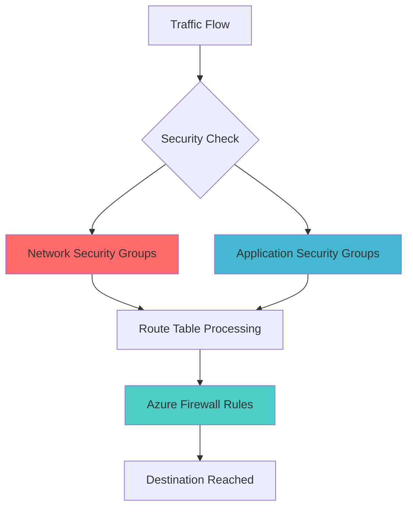

## Conclusion

Understanding Azure's routing hierarchy is essential for reliable hybrid connectivity. The key principles are:

1. **Longest Prefix Match First**: More specific routes always win, regardless of route type
2. **Route Type Priority Second**: When prefixes are identical: UDR → BGP → System
3. **System Route Exception**: VNet, peering, and service endpoint system routes are preferred even over more specific BGP routes
4. **Hidden Routes**: Many critical routing decisions are based on system routes that aren't visible in your configuration

The most common troubleshooting mistake is assuming route type priority applies universally, when in reality, longest prefix match is evaluated first. Always check effective routes to see the complete picture.

The key to successful hybrid routing is planning, documentation, and continuous monitoring. With proper design, your hybrid environment will provide reliable, secure connectivity between on-premises and Azure resources.

Need help with your hybrid Azure networking? Connect with me on LinkedIn for consulting opportunities.

---

*Understanding these routing fundamentals is crucial for building robust, predictable network architectures that scale with your business needs.*