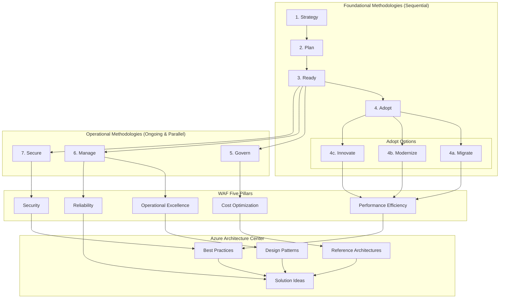
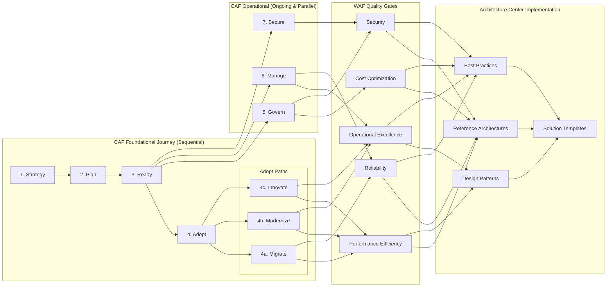

# How CAF, WAF, and Azure Architecture Center Work Together: A Comprehensive Integration Guide

As a Cloud Solution Architect, understanding how Microsoft's Cloud Adoption Framework (CAF), Well-Architected Framework (WAF), and Azure Architecture Center integrate is essential for successful cloud implementations. This guide explores how these frameworks complement each other and provides a holistic approach to Azure adoption.

## Framework Overview

### Cloud Adoption Framework (CAF) - The "Journey"
CAF provides the strategic roadmap for cloud adoption, focusing on the organizational transformation required to successfully adopt cloud technologies.

### Well-Architected Framework (WAF) - The "Quality"
WAF defines the architectural principles and best practices for building robust, scalable, and secure cloud solutions.

### Azure Architecture Center - The "Implementation"
The Architecture Center provides concrete reference architectures, patterns, and implementation guidance.

## Cloud Adoption Framework (CAF) - Methodologies Structure

The CAF organizes its guidance into two distinct types of methodologies that support every part of your Azure journey: Foundational methodologies (sequential) and Operational methodologies (ongoing and parallel).

### Foundational Methodologies
These methodologies are sequential and help establish your Azure foundation and deploy workloads:

#### 1. Strategy
- **Business Justification**: Defining the business case for cloud adoption
- **Cloud Adoption Strategy**: Aligning business outcomes with technical strategy
- **Digital Estate**: Understanding current state and planning future state
- **Business Outcomes**: Defining measurable results from cloud adoption

#### 2. Plan
- **Digital Estate Planning**: Inventory and assessment of existing workloads
- **Adoption Plan**: Creating actionable project plans with timelines
- **Skills Readiness Plan**: Identifying skill gaps and training requirements
- **Cloud Rationalization**: Determining the best approach for each workload

#### 3. Ready
- **Azure Landing Zones**: Establishing the foundation infrastructure
- **Operating Model**: Defining governance, management, and security baselines
- **Azure Setup Guide**: Step-by-step environment preparation
- **Network Design**: Implementing connectivity and segmentation strategies

#### 4. Adopt
This methodology includes three distinct approaches for moving to the cloud:

##### 4a. Migrate
- **Migration Planning**: Assessing and planning workload migrations
- **Migration Tools**: Leveraging Azure Migrate and other migration services
- **Migration Waves**: Organizing migrations in manageable batches
- **Migration Validation**: Testing and validating migrated workloads

##### 4b. Modernize
- **Application Modernization**: Updating applications for cloud optimization
- **Platform Modernization**: Moving to cloud-native services and platforms
- **Data Modernization**: Implementing modern data architectures
- **Integration Modernization**: Updating integration patterns for cloud

##### 4c. Innovate
- **Innovation Methodology**: Building new cloud-native solutions
- **Digital Innovation**: Leveraging AI, IoT, and emerging technologies
- **Customer Engagement**: Creating digital customer experiences
- **Data and Analytics**: Implementing advanced analytics and AI solutions

### Operational Methodologies
These methodologies are implemented in parallel with foundational methodologies and are ongoing as part of operations:

#### 5. Govern
**Governance Disciplines**: Establishing policies and controls across five disciplines:
- **Cost Management**: Optimizing and controlling cloud spend
- **Security Baseline**: Implementing security standards and policies
- **Resource Consistency**: Ensuring consistent resource organization
- **Identity Baseline**: Managing identity and access controls
- **Deployment Acceleration**: Standardizing deployment processes

#### 6. Manage
- **Management Baseline**: Establishing operational excellence
- **Platform Operations**: Managing the Azure foundation infrastructure
- **Workload Operations**: Managing individual applications and services
- **Advanced Operations**: Implementing sophisticated operational practices

#### 7. Secure
- **Security Strategy**: Developing comprehensive security approach
- **Security Controls**: Implementing technical security measures
- **Security Operations**: Establishing ongoing security monitoring and response
- **Zero Trust Implementation**: Adopting zero trust security architecture
- **Compliance Management**: Ensuring regulatory and policy compliance

## Well-Architected Framework (WAF) - Five Pillars

### 1. Cost Optimization
- **Right-sizing resources**: Matching resource capacity to actual demand
- **Reserved Instances**: Long-term commitments for predictable workloads
- **Monitoring and Analytics**: Tracking and optimizing costs continuously
- **Automation**: Using tools to automatically optimize costs

### 2. Operational Excellence
- **Monitoring and Alerting**: Proactive issue detection and resolution
- **Deployment Practices**: Consistent, reliable deployment processes
- **Disaster Recovery**: Planning for and recovering from failures
- **Documentation**: Maintaining comprehensive operational documentation

### 3. Performance Efficiency
- **Scalability**: Handling increased load gracefully
- **Resource Selection**: Choosing appropriate services and configurations
- **Monitoring**: Tracking performance metrics and trends
- **Optimization**: Continuously improving performance

### 4. Reliability
- **Fault Tolerance**: Designing systems to handle component failures
- **Recovery Procedures**: Planning for and testing disaster recovery
- **Monitoring**: Tracking system health and availability
- **Testing**: Regular validation of system resilience

### 5. Security
- **Identity and Access Management**: Controlling who can access what
- **Data Protection**: Encrypting and securing sensitive information
- **Network Security**: Protecting communication channels
- **Threat Detection**: Identifying and responding to security threats

## Azure Architecture Center - Key Components

### 1. Reference Architectures
- **Proven Patterns**: Battle-tested architectural designs
- **Multi-tier Applications**: Traditional application patterns in the cloud
- **Microservices**: Cloud-native architectural patterns
- **Data Architectures**: Analytics and data processing patterns

### 2. Design Patterns
- **Cloud Design Patterns**: Reusable solutions to common problems
- **Integration Patterns**: Connecting systems and services
- **Data Patterns**: Managing data in distributed systems
- **Messaging Patterns**: Asynchronous communication strategies

### 3. Best Practices
- **Implementation Guides**: Step-by-step technical guidance
- **Checklists**: Validation criteria for various scenarios
- **Guidelines**: Recommendations for specific technologies
- **Reviews**: Architecture assessment criteria

### 4. Solution Ideas
- **Industry Solutions**: Vertical-specific architectures
- **Technology Solutions**: Platform-specific implementations
- **Hybrid Solutions**: On-premises and cloud integration
- **Innovation Scenarios**: Emerging technology patterns

## Framework Integration and Intersection

The three frameworks work together in a complementary manner:

## Detailed Integration Scenarios

### Scenario 1: Enterprise Migration Project

**CAF Foundational Methodologies:**
- **Strategy**: Business case for migrating 200 legacy applications to reduce datacenter costs by 40%
- **Plan**: Comprehensive assessment using Azure Migrate, skills gap analysis for cloud operations team
- **Ready**: Implementation of hub-spoke landing zone architecture with ExpressRoute connectivity
- **Adopt - Migrate**: Phased migration approach with 6-month timeline, starting with least critical workloads

**CAF Operational Methodologies (Parallel):**
- **Govern**: Implementation of cost management policies, tagging standards, and RBAC controls
- **Manage**: Establishment of monitoring baselines, backup policies, and incident response procedures
- **Secure**: Zero trust architecture implementation, network segmentation, and identity governance

**WAF Integration:**
- **Cost Optimization**: Reserved instance planning and right-sizing during migration assessment
- **Security**: Implementing defense-in-depth with network security groups and Azure Firewall
- **Reliability**: Multi-region architecture design for critical tier-1 applications
- **Performance**: Application performance testing and optimization for cloud environment
- **Operational Excellence**: Automated deployment pipelines and infrastructure as code adoption

**Architecture Center Application:**
- **Reference Architecture**: Enterprise-scale hub-spoke network topology
- **Patterns**: Strangler Fig pattern for gradual migration of monolithic applications
- **Best Practices**: Azure Migrate assessment and migration factory methodologies
- **Solutions**: Industry-specific migration accelerators and templates

### Scenario 2: Cloud-Native Application Development

**CAF Foundational Methodologies:**
- **Strategy**: Digital transformation initiative to build customer-facing mobile application
- **Plan**: Greenfield development plan with cloud-native architecture from inception
- **Ready**: Container-ready landing zone with AKS and supporting services
- **Adopt - Innovate**: Implementation using microservices architecture, AI/ML integration

**CAF Operational Methodologies (Ongoing):**
- **Govern**: DevSecOps policies, automated compliance checking, cost guardrails
- **Manage**: Application performance monitoring, chaos engineering practices
- **Secure**: Secure software development lifecycle, container security scanning

**WAF Implementation:**
- All five pillars applied from design phase through implementation
- **Cost**: Serverless adoption where appropriate, auto-scaling configurations
- **Security**: Managed identities, Key Vault integration, threat modeling
- **Performance**: CDN implementation, database optimization, caching strategies
- **Reliability**: Multi-region deployment with automated failover capabilities
- **Operational Excellence**: Comprehensive observability, automated testing, blue-green deployments

**Architecture Center Resources:**
- **Reference Architectures**: Microservices on Azure Kubernetes Service
- **Patterns**: Event-driven architecture, CQRS, API gateway patterns
- **Best Practices**: Container security guidelines, Kubernetes best practices
- **Solutions**: Industry-specific cloud-native application templates

### Scenario 3: Hybrid Cloud Implementation

**CAF Foundational Methodologies:**
- **Strategy**: Hybrid approach maintaining on-premises for compliance while extending to cloud
- **Plan**: Workload categorization, compliance mapping, connectivity requirements analysis
- **Ready**: Hybrid landing zone with Azure Arc, ExpressRoute, and VPN connectivity
- **Adopt - Modernize**: Selective modernization of applications while maintaining hybrid connectivity

**CAF Operational Methodologies (Continuous):**
- **Govern**: Unified governance across hybrid environments using Azure Arc
- **Manage**: Centralized monitoring and management across on-premises and cloud
- **Secure**: Consistent security policies and zero trust across hybrid infrastructure

**WAF Application:**
- **Cost**: Hybrid cost optimization considering both on-premises and cloud resources
- **Security**: End-to-end encryption, consistent identity management across environments
- **Reliability**: Disaster recovery across hybrid infrastructure
- **Performance**: Optimized connectivity and data placement strategies
- **Operational Excellence**: Unified operations across hybrid environments

**Architecture Center Guidance:**
- **Reference Architectures**: Hybrid network connectivity patterns
- **Patterns**: Data synchronization, hybrid identity, edge computing patterns
- **Best Practices**: Azure Arc implementation, hybrid security guidelines
- **Solutions**: Industry compliance templates for hybrid scenarios

## Integration Flow Diagram

## Practical Implementation Approach

### Phase 1: Strategic Foundation (CAF Strategy + Plan)
1. Define business outcomes and success metrics aligned with organizational goals
2. Assess current digital estate using Azure Migrate and other assessment tools
3. Create comprehensive adoption roadmap with timelines and resource requirements
4. Identify WAF priorities based on business requirements and risk tolerance
5. Establish cloud center of excellence and governance structure

### Phase 2: Environment Preparation (CAF Ready + Operational Methodologies Setup)
1. Implement Azure Landing Zones following CAF reference architectures
2. Establish foundational governance policies and controls (CAF Govern)
3. Set up security baseline and zero trust architecture principles (CAF Secure)
4. Implement management baseline with monitoring and operational procedures (CAF Manage)
5. Apply Architecture Center networking patterns and security designs

### Phase 3: Workload Implementation (CAF Adopt + All WAF Pillars + Architecture Center)
1. Execute adoption projects using appropriate path (Migrate/Modernize/Innovate)
2. Apply all WAF pillars during design and implementation phases
3. Use Architecture Center patterns and reference architectures
4. Establish continuous feedback loops for optimization and improvement
5. Implement proper testing and validation procedures

### Phase 4: Continuous Optimization (All CAF Operational Methodologies + WAF + Architecture Center)
1. Continuously optimize based on WAF assessment results and recommendations
2. Evolve governance and management practices based on operational experience
3. Update architectures based on new patterns and lessons learned
4. Scale successful approaches across additional workloads and business units
5. Maintain security posture through ongoing assessments and improvements

## Key Success Factors

### 1. Integrated Planning
- Align CAF adoption plan with WAF assessment
- Map Architecture Center patterns to business requirements
- Create integrated success criteria

### 2. Governance Integration
- Embed WAF principles in CAF governance policies
- Use Architecture Center best practices for policy implementation
- Establish regular architecture reviews

### 3. Continuous Improvement
- Regular WAF assessments throughout CAF journey
- Update architectures based on new Architecture Center content
- Evolve practices based on lessons learned

### 4. Skills and Culture
- Train teams on all three frameworks
- Establish communities of practice
- Create feedback mechanisms

## Common Integration Challenges and Solutions

### Challenge 1: Framework Overlap
**Problem**: Teams confused about which framework to use when
**Solution**: Clear mapping of framework purposes and integration points

### Challenge 2: Implementation Complexity
**Problem**: Too many guidelines and practices to follow
**Solution**: Phased approach with priority-based implementation

### Challenge 3: Keeping Current
**Problem**: Frameworks evolve and update frequently
**Solution**: Establish regular review cycles and update processes

### Challenge 4: Cultural Resistance
**Problem**: Teams resistant to structured approaches
**Solution**: Demonstrate value through pilot projects and success stories

## Measuring Success Across Frameworks

### CAF Metrics
- Time to migrate/deploy
- Business outcome achievement
- Governance compliance
- Operational efficiency

### WAF Metrics
- Cost optimization percentage
- System availability (reliability)
- Performance benchmarks
- Security incident reduction
- Operational efficiency improvements

### Architecture Center Implementation
- Pattern reuse across projects
- Architecture review compliance
- Time to solution delivery
- Quality of implementations

## Conclusion

The integration of CAF, WAF, and Azure Architecture Center provides a comprehensive approach to successful cloud adoption and implementation. CAF provides the strategic journey, WAF ensures quality and best practices, and the Architecture Center offers concrete implementation guidance.

Success comes from understanding how these frameworks complement each other and implementing them in a coordinated manner rather than treating them as separate initiatives. Organizations that effectively integrate these frameworks see faster cloud adoption, higher quality implementations, improved governance, and better business outcomes.

By following this integrated approach, you ensure that your cloud journey is not only strategically sound but also technically excellent and practically implementable.