# The Complete AI/ML Guide for Beginners: From Concepts to Implementation

## Executive Summary

Artificial Intelligence is experiencing explosive growth, with the market expected to exceed US$423 billion by 2027 with a 5-year compound annual growth rate (CAGR) of 26.9%. This comprehensive guide provides a critical analysis of AI fundamentals, distinguishing between marketing hype and technical reality. We examine core concepts including predictive versus generative AI, machine learning operations (MLOps), large language models (LLMs), and practical implementation considerations that organizations must understand before embarking on AI initiatives.

**Critical Reality Check:** While AI offers transformative potential, up to 88% of corporate machine learning initiatives struggle to move beyond test stages. This guide prioritizes practical understanding over theoretical complexity, providing the foundational knowledge necessary for informed decision-making in AI adoption.

## Understanding AI: Types and Applications

### The AI Landscape Overview

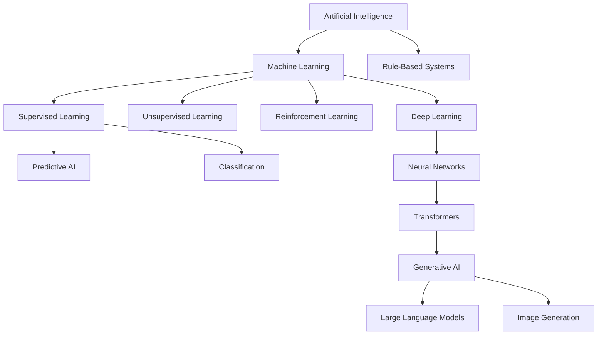

### Predictive AI vs Generative AI: The Fundamental Distinction

**Predictive AI** leverages historical data patterns to make informed predictions about future outcomes. This approach relies on well-established statistical and machine learning techniques.

**Key Characteristics:**
- Uses structured historical data for training
- Outputs predictions, classifications, or numerical values
- Highly interpretable results with measurable accuracy
- Established ROI measurement methodologies

**Enterprise Applications:**
- Demand forecasting and inventory optimization
- Predictive maintenance scheduling
- Risk assessment and fraud detection
- Customer churn prediction

**Generative AI** creates new content by learning patterns from training data and generating novel outputs that mimic the training distribution.

**Key Characteristics:**
- Processes massive, often unstructured datasets
- Generates text, images, code, or other content formats
- Requires significant computational resources
- Complex evaluation metrics and quality assessment

**Enterprise Applications:**
- Automated content generation and marketing copy
- Code generation and software development assistance
- Customer service chatbots and virtual assistants
- Creative design and ideation support

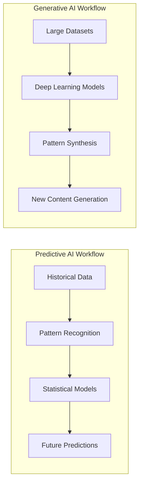

### Critical Assessment: When to Use Each Approach

**Choose Predictive AI When:**
- You have clear, measurable business objectives
- Historical data is abundant and relevant
- Interpretability and regulatory compliance are critical
- ROI can be directly measured and tracked

**Choose Generative AI When:**
- Content creation and automation are primary goals
- You have substantial computational resources available
- Creative augmentation adds measurable business value
- User experience enhancement justifies the investment

**Avoid Both When:**
- The problem can be solved with simpler, rule-based systems
- Data quality is poor or insufficient
- Regulatory constraints prohibit AI usage
- The cost-benefit analysis doesn't support AI implementation

## Large Language Models (LLMs): Architecture and Operations

### Understanding LLM Architecture

Large Language Models are based on the transformer architecture, which leverages an attention mechanism that enables the model to process relationships between all elements in a sequence simultaneously. This represents a fundamental shift from previous sequential processing approaches.

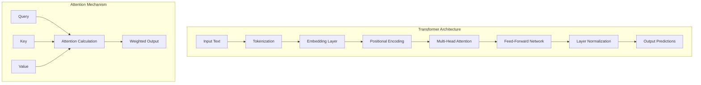

### The Training Process: From Data to Intelligence

LLMs train by trying to predict missing tokens, gradually learning to detect patterns and higher-order structures in the data. This process requires massive computational resources and sophisticated data management.

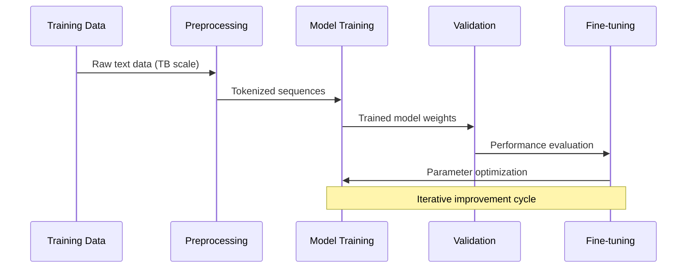

### Critical Model Considerations

**Parameter Scale Reality:**
- GPT-3 has 175 billion parameters
- Training requires thousands of GPUs and weeks to months of dedicated training time
- Inference costs scale with model size and complexity

**Performance Trade-offs:**
- Larger models generally demonstrate better capabilities
- Computational requirements increase exponentially
- Deployment complexity grows with model sophistication

### Foundation Models vs Fine-tuned Models

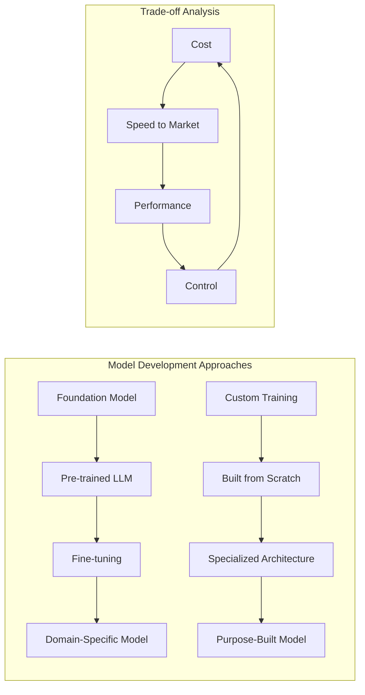

**Foundation Model Advantages:**
- Faster implementation timelines
- Established performance baselines
- Extensive community support and documentation
- Lower initial development costs

**Custom Model Advantages:**
- Complete architectural control
- Optimized for specific use cases
- Potential intellectual property ownership
- Reduced ongoing licensing dependencies

**Critical Decision Framework:**
- **Resource Assessment:** Do you have the expertise and infrastructure for custom development?
- **Use Case Specificity:** Are your requirements unique enough to justify custom development?
- **Regulatory Requirements:** Do compliance needs necessitate full model control?
- **Long-term Strategy:** How does model ownership align with business objectives?

## Machine Learning Operations (MLOps): The Production Reality

### MLOps Definition and Scope

MLOps is an ML culture and practice that unifies ML application development (Dev) with ML system deployment and operations (Ops). This extends beyond simple model deployment to encompass the entire machine learning lifecycle.

### The MLOps Lifecycle

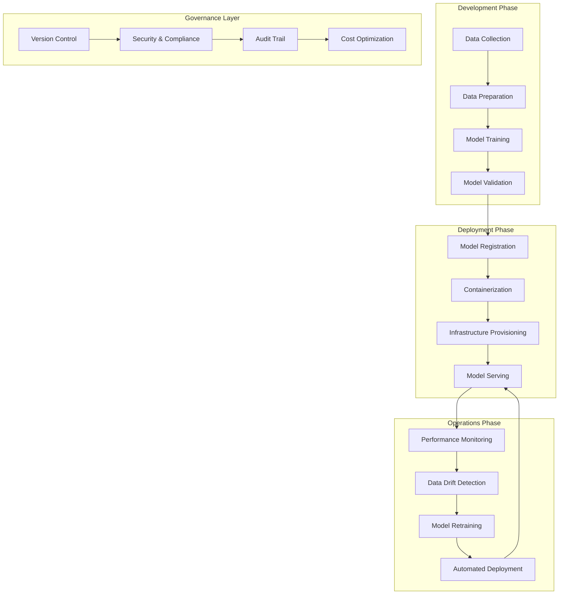

### MLOps Maturity Levels

The level of automation of the Data, ML Model, and Code pipelines determines the maturity of the ML process.

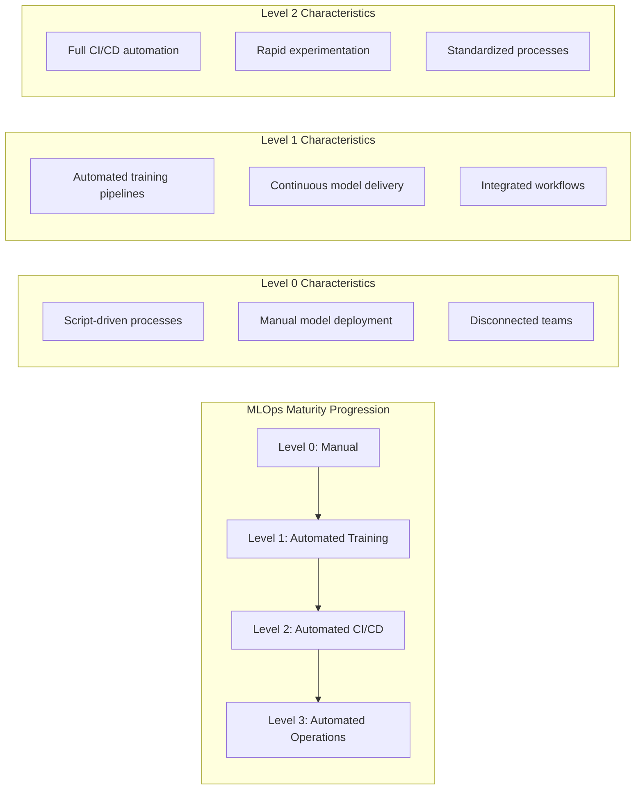

### Critical MLOps Challenges

**Data Management Complexity:**
- Data collection, processing, feature engineering, and data labeling each require dedicated systems with interconnections
- Data versioning and lineage tracking across distributed environments
- Data quality assurance and bias detection at scale

**Infrastructure Requirements:**
- Multi-cloud and hybrid deployment coordination
- Resource scaling for training and inference workloads
- Cost optimization across variable compute demands

**Organizational Challenges:**
- Disparate team involvement: Data scientists, software engineers and IT operations often work in silos, leading to inefficiencies and communication gaps
- Skill gap management across traditional IT and AI/ML domains
- Change management for AI-driven processes

### MLOps Implementation Strategy

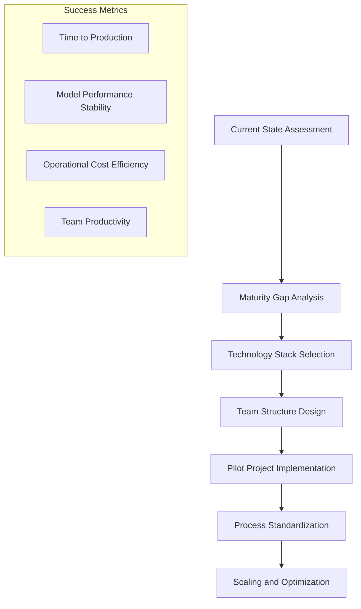

**Implementation Priorities:**
- **Establish Data Pipelines:** Automated data collection, validation, and preparation
- **Implement Model Versioning:** Track model lineage and enable rollback capabilities
- **Deploy Monitoring Systems:** Real-time performance and drift detection
- **Standardize Deployment Processes:** Containerization and infrastructure-as-code

## Fine-Tuning: Customizing Models for Specific Tasks

### Fine-Tuning Fundamentals

Fine-tuning adapts pre-trained models to specific tasks or domains by adjusting model parameters using targeted datasets. This method allows the model to retain the general knowledge it learned during its initial training while adapting to the nuances of your specific data.

### Fine-Tuning Approaches

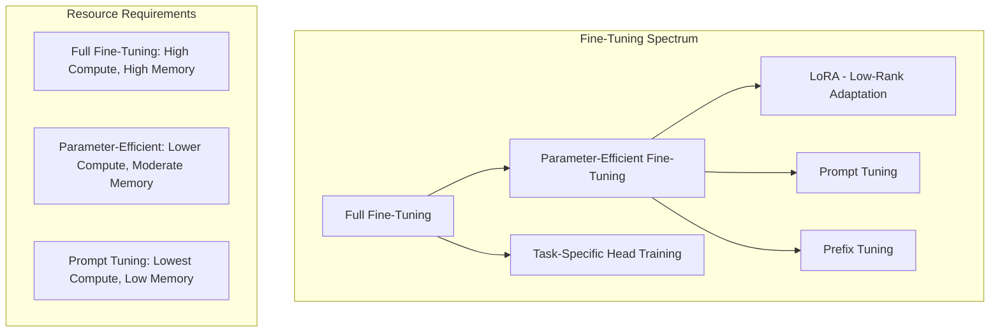

### Alternative Approaches to Fine-Tuning

**Retrieval-Augmented Generation (RAG):**
RAG relies on the use of 1 or more external databases (vector databases) which feed additional context to the question being asked of the gen AI model.

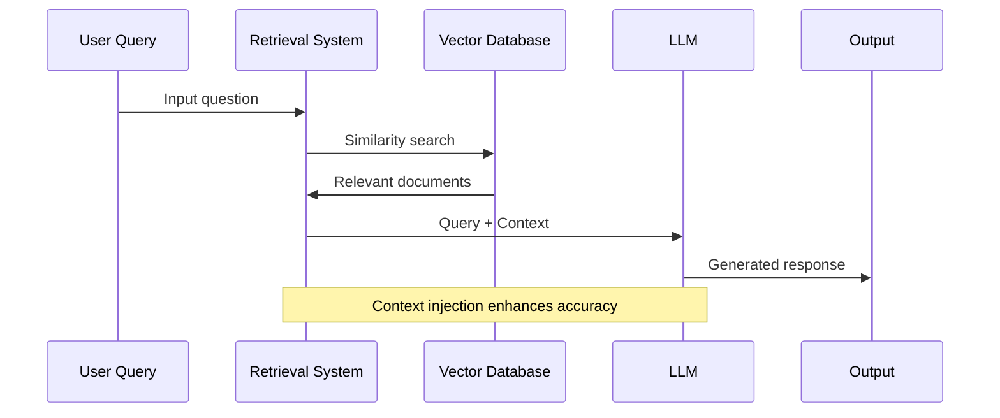

**RAG Advantages:**
- No model retraining required
- Real-time information updates
- Transparency in information sources
- Lower computational requirements

**RAG Limitations:**
- Dependency on retrieval system quality
- Potential context length limitations
- Integration complexity with existing systems

### Fine-Tuning vs RAG Decision Matrix

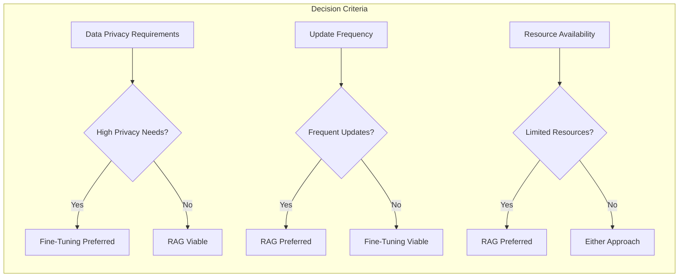

### Critical Implementation Considerations

**Data Quality Requirements:**
- Fine-tuning requires high-quality, representative datasets
- Data bias amplification during training
- Overfitting risks with limited training data

**Performance Evaluation:**
- Establish baseline metrics before fine-tuning
- Implement A/B testing for model comparison
- Monitor for performance degradation on general tasks

**Cost Analysis:**
- Training computational costs
- Ongoing inference optimization
- Data preparation and annotation expenses

## Prompt Engineering: Communicating with AI Systems

### Prompt Engineering Fundamentals

Prompt engineering is the practice of crafting inputs—called prompts—to get the best possible results from a large language model (LLM). This discipline combines technical understanding with strategic communication principles.

### Core Prompt Engineering Techniques

### Prompt Engineering Best Practices

**Clarity and Specificity:**
Specificity is key to obtaining the most accurate and relevant information from an AI when writing prompts. A specific prompt minimizes ambiguity.

**Structured Approach:**

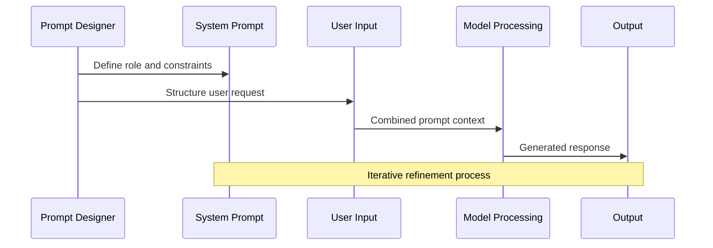

### Advanced Prompting Strategies

**Chain-of-Thought Reasoning:**
Chain-of-thought prompting is a technique that enhances the reasoning abilities of large language models by breaking down complex tasks into simpler sub-steps.

**Example Structure:**
- **Problem Statement:** Clear definition of the task
- **Step-by-Step Reasoning:** Explicit logical progression
- **Intermediate Results:** Show work at each stage
- **Final Answer:** Clearly marked conclusion

**Few-Shot Learning Implementation:**
Few-shot prompting is a technique where examples are included in the prompt, thus facilitating LLM AI learning.

### Critical Prompt Engineering Challenges

**Model Sensitivity:**
- Different models (GPT-4o, Claude 4, Gemini 2.5) respond better to different formatting patterns—there's no universal best practice
- Version-specific behavior variations
- Context window limitations across different models

**Security Considerations:**
- Prompt engineering isn't just a usability tool—it's also a potential security risk when exploited through adversarial techniques
- Prompt injection vulnerabilities
- Data leakage through clever prompting

**Performance Optimization:**

## Infrastructure and Hardware Requirements

### AI Hardware Landscape

The computational demands of AI workloads require specialized hardware considerations that differ significantly from traditional software applications.

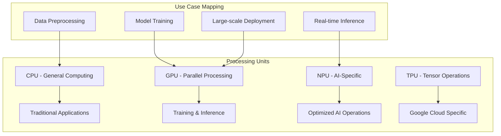

### Infrastructure Architecture Patterns

**Cloud-Based Training, On-Premise Inference:**
This hybrid approach balances computational scalability with data sovereignty requirements.

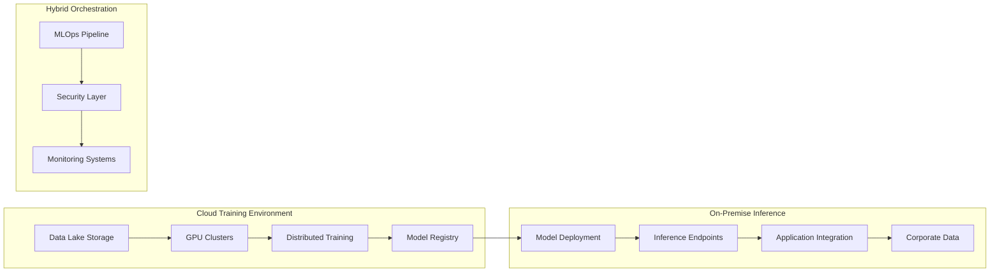

### Infrastructure Considerations

**Scalability Requirements:**
- Training workloads require massive parallel processing capabilities
- Inference demands vary significantly based on user patterns
- Storage requirements grow exponentially with model complexity

**Cost Optimization:**
- GPU utilization efficiency directly impacts operational costs
- Data transfer costs between cloud and on-premise systems
- Reserved vs. on-demand pricing strategies for variable workloads

**Security and Compliance:**
- Data residency requirements for regulated industries
- Model intellectual property protection
- Audit trail maintenance across hybrid environments

## Getting Started: A Practical Implementation Framework

### Organizational Readiness Assessment

Before implementing AI solutions, organizations must honestly evaluate their current capabilities and constraints.

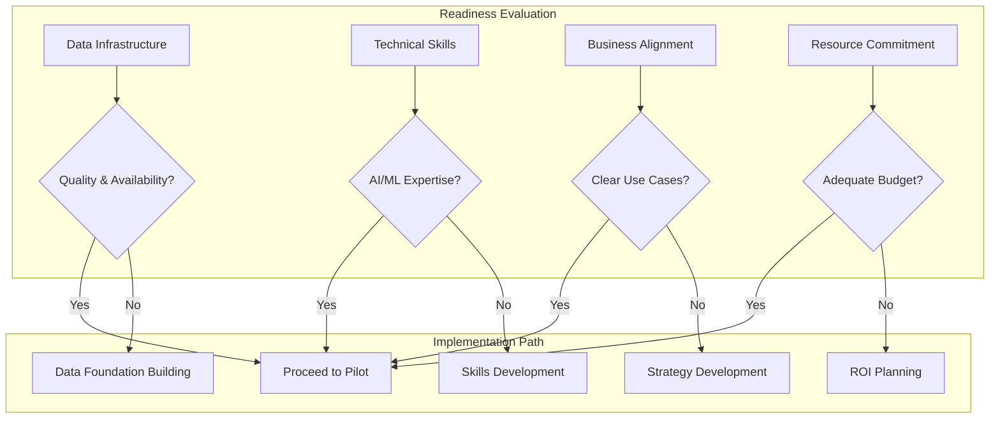

### Implementation Roadmap

**Phase 1: Foundation Building (3-6 months)**

1. **Data Audit and Preparation**
   - Assess data quality and availability
   - Implement data governance frameworks
   - Establish data pipelines and storage infrastructure

2. **Skill Development**
   - Train existing teams on AI/ML fundamentals
   - Hire specialized talent or engage consulting partners
   - Establish collaboration protocols between teams

3. **Technology Stack Selection**
   - Evaluate cloud vs. on-premise requirements
   - Select MLOps platforms and tools
   - Design security and compliance frameworks

**Phase 2: Pilot Implementation (3-6 months)**

1. **Use Case Selection**
   - Identify high-impact, low-risk initial projects
   - Define success metrics and evaluation criteria
   - Establish feedback loops and iteration processes

2. **Model Development and Testing**
   - Implement chosen AI approach (predictive vs. generative)
   - Develop monitoring and evaluation systems
   - Conduct thorough testing and validation

3. **Integration and Deployment**
   - Integrate with existing business systems
   - Deploy monitoring and alerting systems
   - Train end-users and establish support processes

**Phase 3: Scaling and Optimization (6-12 months)**

1. **Performance Optimization**
   - Analyze pilot results and optimize models
   - Scale infrastructure based on usage patterns
   - Implement cost optimization strategies

2. **Expanded Use Cases**
   - Apply lessons learned to additional use cases
   - Develop reusable components and frameworks
   - Establish centers of excellence

### Critical Success Factors

**Realistic Expectations:**
Reports show a majority (up to 88%) of corporate machine learning initiatives are struggling to move beyond test stages. Success requires long-term commitment and realistic timeline expectations.

**Cross-Functional Collaboration:**
AI implementation requires coordination across data science, engineering, business, and operations teams. Establish clear communication protocols and shared success metrics.

**Continuous Learning and Adaptation:**
AI technologies evolve rapidly. Maintain investment in ongoing education and system updates to prevent technical debt accumulation.

## Conclusion: Navigating the AI Implementation Reality

This guide has provided a comprehensive foundation for understanding AI/ML concepts and implementation approaches. The key insights for successful AI adoption include:

### Technical Reality Over Marketing Hype:
- Understand the specific capabilities and limitations of different AI approaches
- Distinguish between proof-of-concept demonstrations and production-ready solutions
- Plan for the substantial infrastructure and operational requirements of AI systems

### Implementation Pragmatism:
- Start with clearly defined business problems and measurable success criteria
- Build data infrastructure and team capabilities before pursuing advanced AI solutions
- Accept that AI implementation is a marathon, not a sprint, requiring sustained organizational commitment

### Strategic Decision-Making Framework:
- Choose between predictive and generative AI based on specific business requirements
- Evaluate fine-tuning vs. RAG approaches based on resource constraints and use case needs
- Design prompt engineering strategies that balance performance with security considerations

### Operational Excellence:
- Implement MLOps practices from the beginning to avoid technical debt accumulation
- Design monitoring and governance systems that scale with AI solution complexity
- Maintain focus on business value delivery rather than technological sophistication

The AI revolution offers substantial opportunities for organizations that approach implementation with realistic expectations, adequate preparation, and sustained commitment. However, success requires moving beyond theoretical understanding to practical implementation expertise, supported by robust infrastructure and organizational change management.

Organizations that invest in foundational capabilities—data infrastructure, team skills, and operational processes—while maintaining strategic focus on business value creation will be best positioned to capture AI's transformative potential. Those that rush to implement advanced AI solutions without adequate preparation will likely join the majority of initiatives that struggle to move beyond experimental stages.

The choice between joining the successful minority or the struggling majority depends on the discipline, resources, and strategic patience organizations bring to their AI journey.