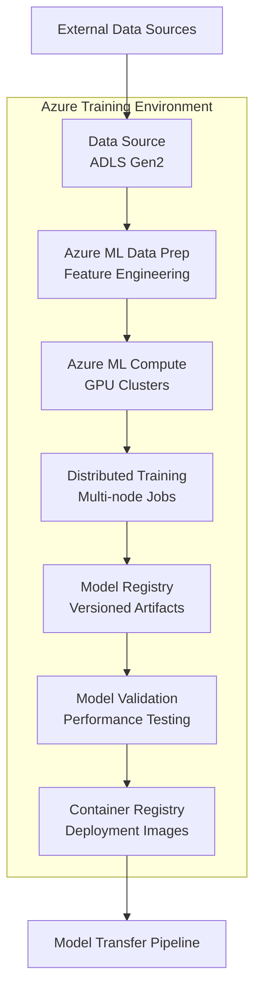
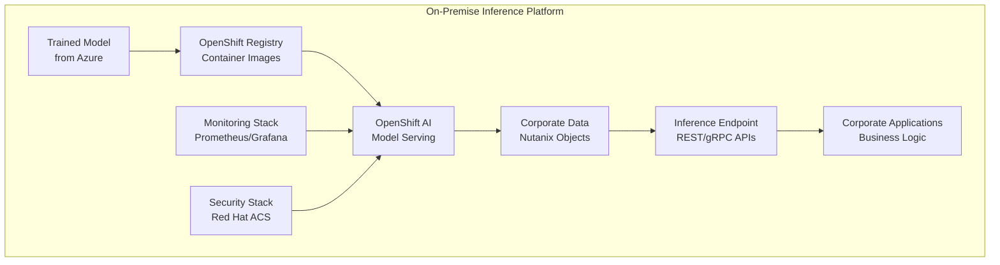

# Enterprise AI Architecture Blueprint: Cloud Training with On-Premise Inference

## Executive Summary

Modern enterprises face a fundamental tension in their AI strategy: the need for massive computational scale during model training versus the requirement for data sovereignty and low-latency inference on sensitive corporate data. This reference architecture presents a hybrid approach that leverages public cloud infrastructure for high-performance training while maintaining on-premise capabilities for secure, compliant inference operations.

**Target Audience:** Cloud Architects, Data Scientists, IT Operations, and Security Professionals seeking to implement enterprise-grade AI solutions that balance performance, security, and compliance requirements.

**Document Philosophy:** This is not a simple implementation guide but a critical analysis of architectural decisions, trade-offs, and operational complexities inherent in hybrid AI deployments. We emphasize the challenges alongside the benefits, providing a realistic foundation for architectural decision-making.

## Conceptual Architecture Overview

The hybrid AI architecture fundamentally separates the compute-intensive training phase from the data-sensitive inference phase, creating a clear boundary between public cloud scalability and private data protection.

```mermaid
C4Context
    title System Context Diagram for Hybrid AI Architecture

    Person(data_scientist, "Data Scientist", "Develops and trains AI models")
    System_Ext(corp_users, "Corporate Users", "Consume AI-powered applications")

    System(azure_cloud, "Azure Public Cloud", "Scalable model training environment")
    System(on_premise, "On-Premise Private Cloud", "Secure, low-latency inference platform")

    Rel(data_scientist, azure_cloud, "Trains models in", "HTTPS/SSH")
    Rel(on_premise, corp_users, "Serves inferences to", "REST/gRPC APIs")

    Boundary(data_pipeline, "Data Pipeline & MLOps", "Orchestration Layer")
    Rel(azure_cloud, on_premise, "Deploys trained models to", "Secure Model Transfer")
    Rel(azure_cloud, data_pipeline, "Orchestrates training", "Azure ML Pipelines")
    Rel(on_premise, data_pipeline, "Manages inference", "OpenShift Operators")
```

**Critical Consideration:** This separation creates operational complexity and potential points of failure at the cloud-to-premise boundary. Organizations must invest significantly in MLOps tooling and processes to manage this hybrid workflow effectively.

## Azure: The Training Engine (Cloud Layer)

### Services & Strategic Justification

**Azure Machine Learning** serves as the central orchestration hub for the entire MLOps lifecycle. Its selection is justified by its native integration with Azure's compute and storage services, comprehensive experiment tracking, and robust model registry capabilities. However, organizations should be aware of vendor lock-in implications and the learning curve associated with Azure ML's extensive feature set.

**Azure Data Lake Storage Gen2** provides the foundation for training data management with its hierarchical namespace and cost-effective storage tiers. The critical trade-off here is data egress costs when moving large datasets, which can become substantial for data-intensive AI workloads.

**Azure Kubernetes Service (AKS)** enables distributed training at scale, particularly crucial for large language models and computer vision applications. The complexity overhead includes cluster management, resource scheduling, and troubleshooting distributed training failures across multiple nodes.

**Azure DevOps/GitHub Actions** implements CI/CD for model lifecycle management. While providing automation benefits, these tools require careful configuration to handle the unique challenges of ML workflows, including data versioning, model validation, and automated testing of inference endpoints.

### Training Pipeline Architecture



**Critical Analysis:** This pipeline introduces several failure points and complexity layers. Data preparation often consumes 60-80% of the project timeline, and distributed training requires sophisticated error handling and checkpoint management. Organizations frequently underestimate the operational overhead of managing these cloud-scale training environments.

## On-Premise: The Inference Platform (Private Layer)

### Infrastructure Foundation & Justification

**Nutanix AOS/AHV** provides the hyperconverged infrastructure foundation, chosen for its simplified management model and predictable performance characteristics. The trade-off involves higher per-unit compute costs compared to traditional three-tier architectures, but this is offset by reduced operational complexity and faster deployment cycles.

**Red Hat OpenShift** serves as the enterprise Kubernetes platform, selected for its enterprise-grade security features, operator ecosystem, and consistent hybrid cloud experience. OpenShift's complexity requires specialized expertise and introduces a significant learning curve for traditional infrastructure teams.

**Nutanix Kubernetes Platform (NKP)** integrates with OpenShift to provide seamless infrastructure provisioning and lifecycle management. This tight integration reduces operational overhead but creates potential vendor dependencies that organizations should carefully evaluate.

**Nutanix Objects Storage** maintains private corporate data on-premise, providing S3-compatible APIs while ensuring data sovereignty. Performance characteristics may not match public cloud object storage, requiring careful capacity planning for data-intensive inference workloads.

**Red Hat OpenShift AI** manages inference endpoint deployment, scaling, and monitoring. While providing comprehensive MLOps capabilities, it requires significant investment in training and process adaptation for traditional IT operations teams.

**Red Hat Ansible Automation Platform** automates deployment and configuration management across the inference infrastructure. The complexity lies in maintaining automation scripts and handling the diverse configuration requirements of AI workloads.

### Inference Pipeline Architecture



**Critical Considerations:** On-premise inference introduces challenges around resource utilization, scaling limitations, and maintenance overhead. Unlike cloud environments, capacity planning becomes crucial, and hardware refresh cycles must be carefully managed to maintain performance standards.

## Integration and Security Architecture

### Data Transfer & Connectivity

Model artifacts transfer from Azure to on-premise infrastructure through carefully orchestrated pipelines that prioritize security and reliability. Azure ExpressRoute provides dedicated, private connectivity with predictable bandwidth and latency characteristics, though at significant cost. Alternative approaches using VPN Gateway connections offer cost savings but introduce variable performance and potential bandwidth limitations.

The model transfer process involves containerizing trained models in Azure Container Registry, followed by secure transfer to on-premise container registries. This process requires careful orchestration to handle large model files (often multi-gigabyte) and ensure version consistency across environments.

**Critical Challenge:** Model synchronization between environments can become complex, particularly for organizations with frequent model updates or multiple model variants. Implementing robust versioning and rollback mechanisms is essential but adds operational complexity.

### Security Posture Analysis

The hybrid architecture necessitates a comprehensive Zero Trust security model spanning both cloud and on-premise environments.

**Cloud Security (Azure):**
- Azure Private Endpoints isolate ML services from public internet exposure, though configuration complexity increases significantly
- Network Security Groups provide micro-segmentation but require careful rule management to avoid blocking legitimate ML workloads
- Azure Key Vault centralizes credential management, introducing a critical dependency that must be carefully monitored and maintained

**On-Premise Security:**
- Red Hat Advanced Cluster Security (ACS) provides runtime security and compliance scanning, though its comprehensive feature set requires dedicated security expertise
- OpenShift Network Policies enable microsegmentation within the Kubernetes cluster, but policy management can become complex in dynamic AI environments
- Nutanix Flow delivers network microsegmentation at the infrastructure level, adding another layer of security controls that must be coordinated with application-level policies

**Data Protection:**
- Encryption in transit using TLS 1.3 for all data movement, with certificate management becoming a significant operational concern
- Encryption at rest across all storage tiers, with key management strategies requiring careful coordination between cloud and on-premise systems
- Private networking to prevent data exposure, though this can complicate troubleshooting and monitoring efforts

## Operational Considerations (MLOps)

### Monitoring & Observability Strategy

Implementing unified monitoring across hybrid environments presents significant challenges. Azure Monitor provides comprehensive cloud-side visibility, while OpenShift's built-in Prometheus/Grafana stack handles on-premise monitoring. The critical gap lies in correlating metrics and events across these disparate systems.

Key monitoring requirements include:
- Model performance drift detection across inference endpoints
- Infrastructure resource utilization and capacity planning
- Security event correlation between cloud training and on-premise inference
- Application performance monitoring for AI-powered business applications

**Reality Check:** Most organizations underestimate the complexity of hybrid monitoring. Expect 6-12 months to achieve mature observability across the full stack, with ongoing investment required for dashboard maintenance and alert tuning.

### Scalability & Cost Management

**Training Scalability (Cloud):** Azure provides virtually unlimited scale for training workloads, but costs can escalate rapidly. GPU-intensive training jobs can consume thousands of dollars per day, making cost governance and resource optimization critical.

**Inference Scalability (On-Premise):** Physical infrastructure limits constrain inference scaling, requiring careful capacity planning and potential overflow strategies to public cloud during demand spikes.

**Cost Management Strategy:**
- Implement automated training job scheduling to leverage reserved instance pricing
- Deploy inference autoscaling based on actual demand patterns rather than peak capacity
- Regular cost reviews focusing on data egress charges and underutilized resources
- Consider hybrid inference strategies for handling demand bursts

### Maintenance & Upgrade Complexity

The hybrid architecture multiplies maintenance overhead compared to single-environment deployments:

**Cloud Components:** Azure services auto-update, but this can break ML pipelines without warning. Implementing proper testing and staging environments becomes critical.

**On-Premise Components:** Manual update coordination across Nutanix, OpenShift, and various operators requires careful planning and extensive testing. Expect quarterly maintenance windows and potential service disruptions.

**Integration Points:** The boundaries between cloud and on-premise systems require the most attention, as updates on either side can break integration workflows.

## Use Case Example: Financial Fraud Detection

Consider a large financial institution implementing real-time fraud detection using this hybrid architecture:

**Training Phase (Azure):** Large-scale historical transaction data (petabytes) is processed in Azure Data Lake, with distributed training across multiple GPU clusters to develop sophisticated ensemble models. The cloud environment provides the computational power necessary to process years of transaction history and complex feature engineering.

**Inference Phase (On-Premise):** Real-time transaction scoring occurs on-premise using current customer data that cannot leave the corporate environment due to regulatory requirements. Sub-100ms response times are achieved through optimized inference endpoints running on dedicated GPU infrastructure.

**Business Impact:** The institution achieves a 40% improvement in fraud detection accuracy while maintaining regulatory compliance and meeting strict latency requirements. However, the implementation required 18 months, a team of 25 specialists, and ongoing operational costs of $2M annually.

**Lessons Learned:**
- Data pipeline complexity exceeded initial estimates by 300%
- Model serving optimization required significant custom development
- Regulatory approval processes added 6 months to the timeline
- Ongoing model retraining coordination remains operationally challenging

## Conclusion

This hybrid AI architecture, enhanced with RHEL AI development capabilities and integrated business intelligence, represents a sophisticated approach to balancing cloud scale with data sovereignty requirements. However, organizations must honestly assess their readiness for the substantial operational complexity this comprehensive solution introduces.

### Key Architectural Realities:

- The addition of RHEL AI as a development platform improves accessibility but multiplies model management complexity across hybrid boundaries
- PowerBI integration requires significant additional architecture planning and introduces new points of failure in the hybrid environment
- Multi-platform monitoring and troubleshooting demands expertise across Azure, OpenShift, RHEL, and BI technologies
- Data governance becomes exponentially more complex when AI insights must flow through multiple platforms and security boundaries

### Total Cost Assessment:
Organizations should expect total implementation costs 75-150% above initial projections when accounting for RHEL AI licensing, PowerBI Premium subscriptions, specialized cross-platform expertise, and extended integration timelines. Ongoing operational investment includes dedicated MLOps teams spanning multiple technology stacks, continuous optimization across hybrid boundaries, and complex license management for enterprise AI tools.

### Skills and Resource Requirements:
Success demands teams with expertise spanning cloud architecture, Kubernetes operations, traditional Linux administration, AI/ML development, and business intelligence integration. This skill set combination is rare and expensive, requiring significant investment in training or external consulting relationships.

### Implementation Timeline Reality:
Complete implementations typically require 24-36 months when including BI integration, regulatory compliance, and full operational readiness. Organizations consistently underestimate the complexity of data governance, cross-platform authentication, and performance optimization across hybrid boundaries.

### Strategic Assessment: 
This architecture delivers significant competitive advantages for organizations with the technical expertise, financial resources, and organizational commitment necessary to manage its inherent complexity. The combination of cloud-scale training, enterprise-grade development environments, production inference capabilities, and integrated business intelligence creates a comprehensive AI platform capable of supporting diverse use cases while maintaining data sovereignty.

However, organizations should pursue this approach only if they possess mature DevOps capabilities, substantial budget flexibility, and strategic patience for complex technology integration projects. For most enterprises, a phased implementation approach—beginning with either pure cloud or pure on-premise solutions before adding hybrid complexity—proves more successful than attempting full hybrid deployment from the outset.

The ongoing operational investment extends far beyond initial deployment, requiring continuous architecture evolution, regular technology stack updates, security management across multiple platforms, and performance optimization as business requirements change. Success depends not just on technical implementation but on organizational transformation to support this new operational paradigm.