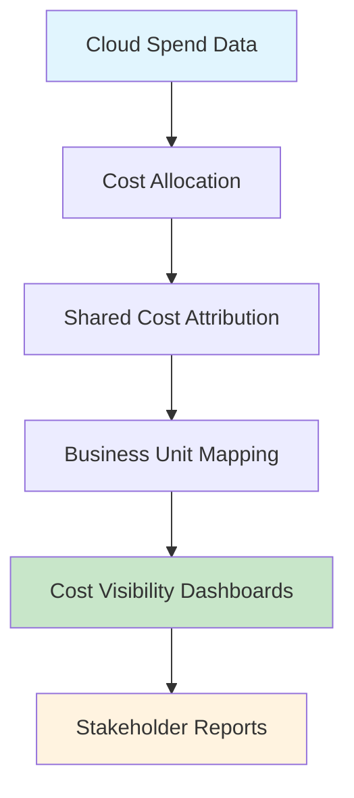
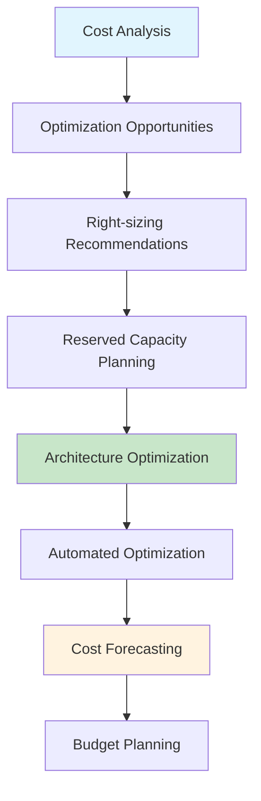
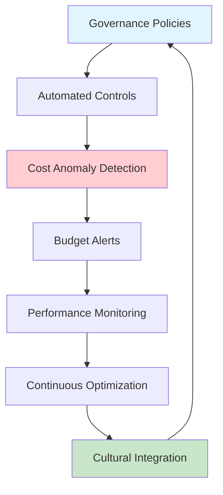
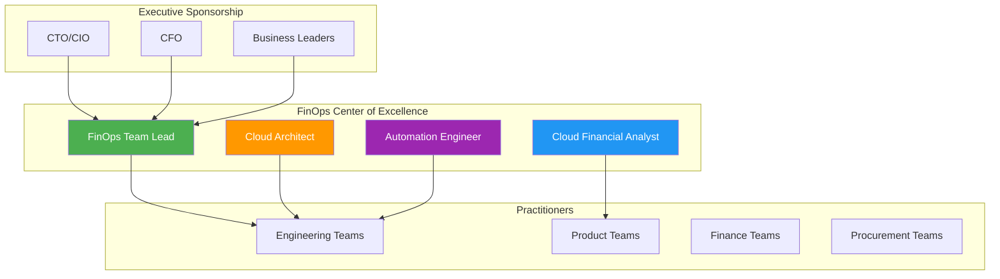
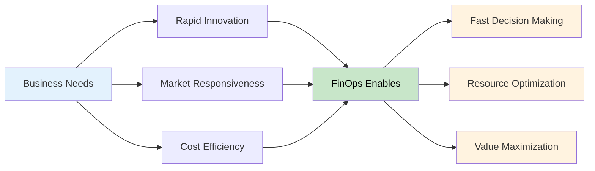
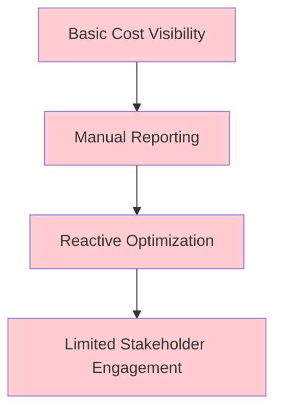
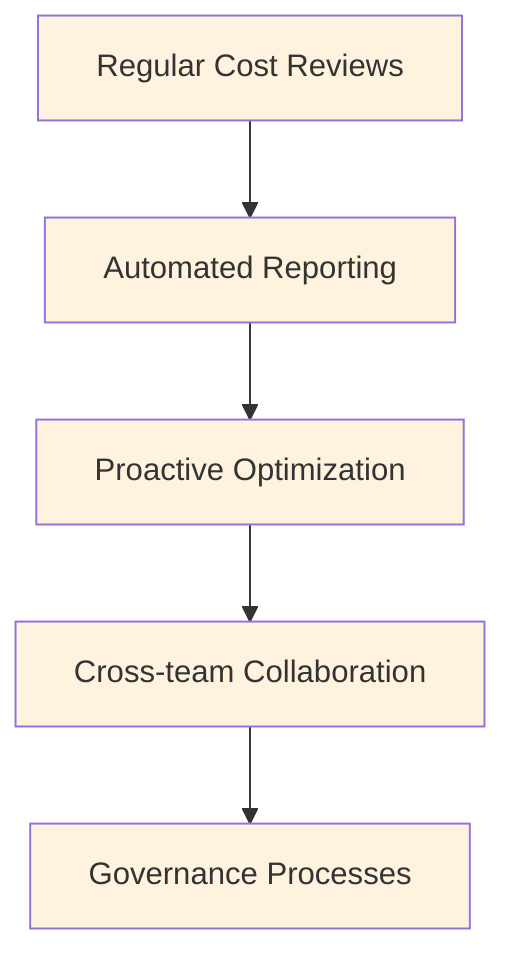
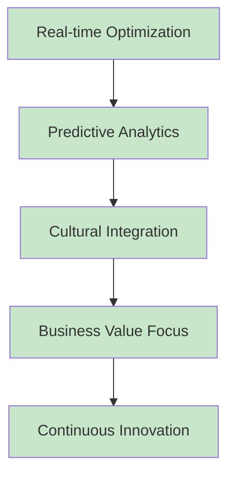
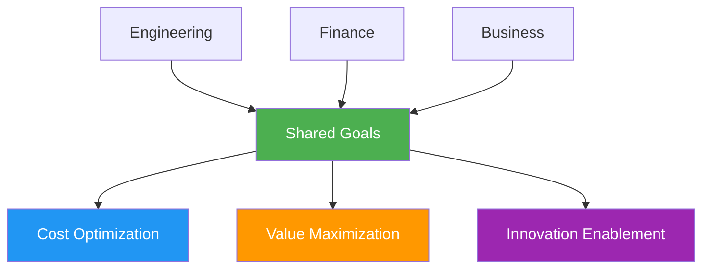

# FinOps Framework: The Strategic Foundation for Cloud Financial Management

As organizations rapidly adopt cloud technologies, a critical challenge emerges: managing cloud costs effectively while enabling business growth and innovation. Traditional IT financial management approaches fall short in the dynamic, consumption-based world of cloud computing. Enter FinOps - a cultural practice and operational framework that brings financial accountability to the variable spend model of cloud computing.

As someone who has been working in cloud cost optimization and financial management throughout my IT career, I've experienced the evolution from traditional IT financial management to the emergence of FinOps as a formal discipline. Since the FinOps Foundation was established in 2019, I've witnessed firsthand how this framework can transform cloud operations from cost centers into strategic business enablers. This comprehensive guide explores the FinOps framework, its critical importance, and practical implementation strategies.

## What is FinOps?

FinOps, short for Financial Operations, is an evolving cloud financial management discipline and cultural practice that enables organizations to get maximum business value by helping engineering, finance, technology, and business teams collaborate on data-driven spending decisions.

The FinOps Foundation defines it as: "An operational framework that brings together people, processes, and tools to accelerate business value realization through improved financial accountability and efficiency in cloud usage."

## Core Principles of FinOps

### 1. Teams Need to Collaborate
Breaking down silos between Finance, Engineering, and Business teams to create shared responsibility for cloud costs and value creation.

### 2. Everyone Takes Ownership
Every team and individual who uses cloud resources takes responsibility for their usage and associated costs, not just the finance department.

### 3. A Centralized Team Drives FinOps
A dedicated FinOps team provides expertise, tools, and governance while enabling teams to make autonomous decisions within established frameworks.

### 4. Take Advantage of the Variable Cost Model
Embracing cloud's flexibility and variable costs as strategic advantages rather than management challenges.

### 5. Reports Should Be Accessible and Timely
Cost visibility and insights must be available when and where teams need them to make effective decisions.

### 6. Decisions Are Driven by Business Value
All cost optimization decisions should be evaluated based on their impact on business outcomes, not just absolute cost reduction.

## The FinOps Lifecycle

The FinOps framework operates on a continuous lifecycle with three phases:

### Phase 1: Inform (Visibility & Allocation)

**Objective**: Create visibility into current cloud spending and usage patterns.

**Key Activities:**
- Establish cost allocation and tagging strategies
- Implement chargeback and showback models
- Create real-time cost visibility dashboards
- Develop benchmarking and trending reports
- Map costs to business units and applications

**Outcomes:**
- 100% cost allocation accuracy
- Real-time cost visibility for all teams
- Clear understanding of cost trends and drivers
- Established baseline metrics and benchmarks

### Phase 2: Optimize (Cloud Efficiency & Planning)

**Objective**: Identify and implement cost optimization opportunities while maintaining performance and reliability.

**Key Activities:**
- Resource right-sizing and optimization
- Reserved instance and savings plan management
- Architecture reviews for cost efficiency
- Waste elimination and cleanup automation
- Capacity planning and forecasting

**Outcomes:**
- 15-30% cost reduction through optimization
- Automated optimization processes
- Improved resource utilization rates
- Accurate cost forecasting and budgets

### Phase 3: Operate (Continuous Improvement & Governance)

**Objective**: Establish ongoing governance and continuous improvement processes.

**Key Activities:**
- Implement cost governance policies
- Establish automated controls and guardrails
- Create anomaly detection and alerting
- Develop optimization automation
- Foster FinOps culture and practices

**Outcomes:**
- Sustainable cost optimization
- Proactive cost management
- Cultural adoption of FinOps practices
- Continuous business value improvement

## The FinOps Operating Model

### Organizational Structure

**Executive Sponsorship**: Provides strategic direction, funding, and organizational support for FinOps initiatives.

**FinOps Center of Excellence**: Central team that develops frameworks, tools, and processes while enabling autonomous team decisions.

**Practitioners**: Engineering, product, and business teams who make day-to-day decisions about cloud resources and costs.

### Key Roles and Responsibilities

**FinOps Practitioner**: Individual responsible for day-to-day FinOps activities, cost analysis, and optimization recommendations.

**FinOps Team Lead**: Manages the FinOps program, coordinates between teams, and drives strategic initiatives.

**Cloud Financial Analyst**: Focuses on cost analysis, forecasting, budgeting, and financial reporting.

**Cloud Architect**: Provides technical expertise for architecture optimization and best practices.

**Engineering Teams**: Implement optimization recommendations and build cost-conscious applications.

**Finance Teams**: Provide financial oversight, budgeting, and business value analysis.

## Why FinOps is Critical for Modern Organizations

### 1. Cloud Spend Growth and Complexity

**Exponential Growth**: Organizations typically see 20-50% annual growth in cloud spending as they migrate more workloads and scale operations.

**Complexity Challenges**: Multi-cloud environments, diverse services, and dynamic pricing models create unprecedented complexity in cost management.

**Visibility Gaps**: Traditional financial tools and processes aren't designed for the granular, real-time nature of cloud costs.

### 2. Business Agility Requirements

**Speed of Innovation**: Modern businesses need to rapidly deploy, scale, and modify cloud resources to respond to market opportunities.

**Cost Predictability**: Finance teams need accurate forecasting and budgeting despite variable cloud consumption patterns.

**Value Optimization**: Organizations must maximize business value from cloud investments, not just minimize costs.

### 3. Cultural and Organizational Transformation

**Shared Responsibility**: FinOps creates shared ownership of cloud costs across engineering, finance, and business teams.

**Data-Driven Decisions**: Enables teams to make informed decisions based on real-time cost and performance data.

**Continuous Improvement**: Establishes practices for ongoing optimization and value maximization.

## The Business Impact of FinOps

### Financial Benefits

**Cost Reduction**: Organizations typically achieve 15-30% cost savings within the first year of FinOps implementation.

**Budget Accuracy**: Improved forecasting accuracy from ±50% to ±10% for cloud spending.

**Waste Elimination**: Identification and elimination of 20-40% of cloud waste through unused resources and overprovisioning.

### Operational Benefits

**Faster Decision Making**: Real-time cost visibility enables rapid resource allocation decisions.

**Improved Efficiency**: Automated optimization processes reduce manual effort by 60-80%.

**Better Resource Utilization**: Average resource utilization improvements of 25-40%.

### Strategic Benefits

**Business Alignment**: Clear connection between cloud spend and business value creation.

**Innovation Enablement**: Freed-up budget can be reinvested in innovation and growth initiatives.

**Competitive Advantage**: Cost efficiency enables competitive pricing and higher profit margins.

## FinOps Maturity Model

Organizations typically progress through three maturity stages:

### Crawl Stage (Reactive)

**Characteristics:**
- Monthly or quarterly cost reporting
- Manual analysis and optimization
- Limited cost allocation accuracy
- Reactive approach to cost management
- Basic tooling and processes

**Focus Areas:**
- Establish basic cost visibility
- Implement foundational tagging
- Create initial stakeholder awareness
- Build basic reporting capabilities

### Walk Stage (Managed)

**Characteristics:**
- Weekly cost reviews and analysis
- Automated optimization processes
- Accurate cost allocation (80%+)
- Regular cross-team collaboration
- Established governance processes

**Focus Areas:**
- Implement automation for optimization
- Develop forecasting capabilities
- Establish governance frameworks
- Build cross-functional collaboration

### Run Stage (Optimized)

**Characteristics:**
- Real-time cost optimization
- Predictive analytics and ML-driven insights
- FinOps fully integrated into culture
- Business value-focused decisions
- Continuous innovation in practices

**Focus Areas:**
- Advanced analytics and ML
- Cultural transformation
- Business value optimization
- Industry leadership and innovation

## FinOps Implementation Strategy

### Phase 1: Foundation Building (Months 1-3)

**Establish Executive Sponsorship:**
- Secure executive buy-in and funding
- Define success metrics and goals
- Establish governance structure

**Form FinOps Team:**
- Hire or designate FinOps practitioners
- Define roles and responsibilities
- Establish team charter and objectives

**Implement Basic Visibility:**
- Deploy cost management tools
- Establish tagging strategies
- Create initial dashboards and reports

### Phase 2: Process Development (Months 4-9)

**Cost Allocation and Showback:**
- Implement accurate cost allocation
- Develop showback/chargeback models
- Create business unit cost reporting

**Optimization Programs:**
- Right-sizing initiatives
- Reserved capacity planning
- Architecture optimization reviews

**Governance and Controls:**
- Budget management processes
- Cost anomaly detection
- Automated policy enforcement

### Phase 3: Cultural Integration (Months 10-18)

**Team Enablement:**
- FinOps training and education
- Self-service tools and dashboards
- Decision-making frameworks

**Advanced Optimization:**
- Machine learning-driven optimization
- Predictive cost modeling
- Advanced automation

**Continuous Improvement:**
- Regular practice assessment
- Industry benchmarking
- Innovation experiments

## Key Success Factors

### 1. Leadership Commitment

**Executive Sponsorship**: Strong support from C-level executives is essential for organizational change.

**Cultural Change**: Leadership must model and reinforce FinOps behaviors and principles.

**Investment**: Adequate funding for tools, training, and dedicated resources.

### 2. Cross-Functional Collaboration

**Breaking Silos**: Eliminate traditional barriers between finance and engineering teams.

**Shared Metrics**: Establish common success metrics across all teams.

**Regular Communication**: Frequent cross-team meetings and updates.

### 3. Technology and Automation

**Tool Selection**: Choose appropriate tools for cost management, optimization, and reporting.

**Integration**: Ensure tools integrate with existing systems and workflows.

**Automation**: Automate repetitive tasks and optimization processes.

### 4. Measurement and Improvement

**KPI Tracking**: Establish and monitor key performance indicators.

**Regular Reviews**: Conduct periodic assessments of FinOps maturity and effectiveness.

**Continuous Learning**: Stay current with industry best practices and innovations.

## Common Challenges and Solutions

### Challenge 1: Organizational Resistance

**Problem**: Teams resistant to change, cost accountability, or new processes.

**Solutions:**
- Start with willing early adopters
- Demonstrate quick wins and value
- Provide training and support
- Align incentives with FinOps goals

### Challenge 2: Data Quality and Accuracy

**Problem**: Inconsistent tagging, incomplete cost allocation, or data accuracy issues.

**Solutions:**
- Implement governance policies
- Use automation for consistency
- Regular data quality audits
- Gradual improvement approach

### Challenge 3: Tool Complexity

**Problem**: Complex tools that are difficult to use or understand.

**Solutions:**
- Choose user-friendly solutions
- Provide comprehensive training
- Create simplified dashboards
- Implement gradual rollouts

### Challenge 4: Measuring Business Value

**Problem**: Difficulty connecting cost optimization to business outcomes.

**Solutions:**
- Define clear business value metrics
- Create value attribution models
- Regular business impact assessments
- Stakeholder education on value

## FinOps Tools and Technology Stack

### Cost Management Platforms

#### Cloud Native Tools:
- **Azure Cost Management + Billing**: Native Azure cost management and optimization
- **AWS Cost Explorer**: Amazon's cost analysis and optimization platform
- **Google Cloud Billing**: Google's cost management and reporting tools

#### Third-Party Solutions:
- **CloudHealth (VMware)**: Multi-cloud cost management and optimization
- **Cloudability (Apptio)**: Enterprise cloud financial management
- **CloudCheckr**: Cloud management and cost optimization
- **Spot by NetApp**: Workload optimization and automation

### Specialized FinOps Tools

#### Forecasting and Analytics:
- **Anodot**: AI-powered cost anomaly detection
- **Yotascale**: Cloud cost analytics and optimization
- **Densify**: Workload optimization and rightsizing

#### Governance and Automation:
- **Cloud Custodian**: Policy-as-code for cloud governance
- **Terraform**: Infrastructure as code with cost optimization
- **Kubernetes Cost Management**: Container cost allocation and optimization

## Measuring FinOps Success

### Financial KPIs
- **Cost per Unit**: Trending cost per business unit of value
- **Cost Variance**: Actual vs. budgeted cloud spend accuracy
- **Cost Avoidance**: Savings achieved through optimization initiatives
- **ROI**: Return on investment for FinOps program and tools

### Operational KPIs
- **Cost Allocation Accuracy**: Percentage of costs properly attributed
- **Mean Time to Resolution**: Speed of addressing cost anomalies
- **Automation Coverage**: Percentage of optimization processes automated
- **Tool Adoption**: Usage rates of FinOps tools and dashboards

### Cultural KPIs
- **Team Engagement**: Participation in FinOps activities and training
- **Decision Quality**: Improvement in cost-related decision making
- **Knowledge Sharing**: Cross-team collaboration and communication
- **Maturity Progression**: Advancement through FinOps maturity stages

## Future of FinOps

### Emerging Trends

**AI and Machine Learning**: Advanced predictive analytics, automated optimization, and intelligent cost management.

**Real-Time Optimization**: Instant cost optimization based on real-time usage patterns and business priorities.

**Sustainability Integration**: Carbon footprint tracking and optimization alongside cost management.

**Multi-Cloud Sophistication**: Advanced tools and practices for complex multi-cloud environments.

### Industry Evolution

**Standardization**: Industry standards and best practices becoming more mature and widely adopted.

**Integration**: Deeper integration between FinOps and other operational disciplines like DevOps and SRE.

**Specialization**: Emergence of specialized roles and career paths in FinOps.

**Education**: Formal training programs and certifications becoming more available.

## Getting Started with FinOps

### Step 1: Assessment
- Evaluate current cloud cost management maturity
- Identify key stakeholders and champions
- Assess existing tools and processes
- Define success criteria and goals

### Step 2: Strategy Development
- Create FinOps implementation roadmap
- Define organizational structure and roles
- Select initial tools and platforms
- Establish governance framework

### Step 3: Pilot Implementation
- Start with a focused pilot project
- Implement basic cost visibility
- Establish cost allocation for pilot scope
- Measure and demonstrate value

### Step 4: Scale and Expand
- Expand to additional business units
- Implement advanced optimization
- Develop cultural practices
- Establish continuous improvement

## Best Practices for FinOps Success

### 1. Start Small, Think Big
Begin with a focused pilot that can demonstrate value quickly, but design with enterprise-wide scalability in mind.

### 2. Focus on People and Process First
Technology is important, but cultural change and process improvement are more critical for long-term success.

### 3. Measure What Matters
Establish meaningful KPIs that connect to business outcomes, not just technical metrics.

### 4. Automate Everything Possible
Manual processes don't scale. Invest in automation to reduce effort and improve consistency.

### 5. Embrace Continuous Learning
FinOps is an evolving discipline. Stay current with best practices and continuously improve your approach.

### 6. Celebrate Successes
Recognize and celebrate wins to build momentum and reinforce positive behaviors.

## Conclusion: FinOps as a Strategic Imperative

FinOps is not just about cost reduction—it's about enabling organizations to maximize business value from their cloud investments. In an era where cloud spending represents a significant portion of IT budgets and continues to grow rapidly, FinOps has become a strategic imperative rather than a nice-to-have capability.

Organizations that successfully implement FinOps gain significant competitive advantages:

**Financial Control**: Predictable cloud costs and budgets that support business planning and growth.

**Operational Efficiency**: Optimized resource utilization and automated processes that free up resources for innovation.

**Business Agility**: Rapid decision-making capabilities that enable quick response to market opportunities.

**Cultural Transformation**: Cross-functional collaboration and shared accountability that improves overall organizational effectiveness.

The journey to FinOps maturity requires commitment, patience, and persistence. However, the benefits—financial, operational, and strategic—make it one of the most important capabilities organizations can develop in the cloud era.

As cloud adoption continues to accelerate and complexity increases, FinOps will only become more critical. Organizations that invest in building strong FinOps capabilities today will be better positioned to thrive in the cloud-first future.

The question is not whether your organization needs FinOps, but how quickly you can begin implementing it effectively. The sooner you start, the sooner you'll begin realizing the transformative benefits of this powerful framework.

---

*This comprehensive guide provides the strategic foundation and practical roadmap needed to successfully implement FinOps practices that drive financial accountability, operational efficiency, and business value in your cloud journey.*