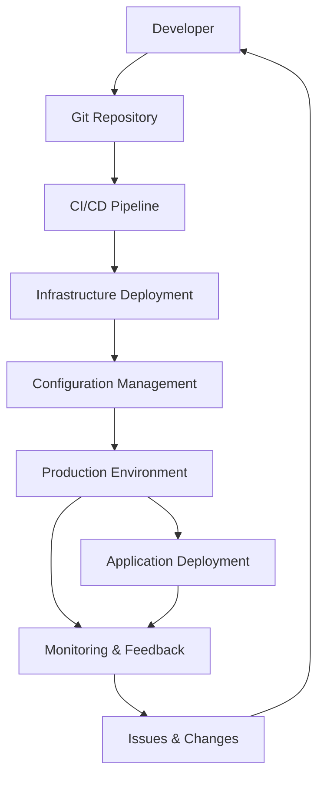

# Infrastructure as Code: Complete Implementation Guide with CI/CD Pipeline

Infrastructure as Code (IaC) has become essential for modern cloud operations, enabling automated, consistent, and scalable infrastructure management. This comprehensive guide covers everything you need to implement IaC with a complete CI/CD pipeline, from technology selection to team collaboration strategies.

## 1. The Big Picture: Why IaC and CI/CD Matter

### Business Benefits of Infrastructure as Code

**Cost Reduction**
- Eliminate manual configuration errors (reduce downtime costs)
- Faster deployment cycles (reduce time-to-market)
- Consistent environments (reduce troubleshooting time)
- Automated scaling (optimize resource costs)

**Risk Mitigation**
- Version-controlled infrastructure changes
- Reproducible environments across dev/test/prod
- Disaster recovery through code recreation
- Compliance through standardized deployments

**Operational Excellence**
- Self-documenting infrastructure
- Faster onboarding of new team members
- Standardized deployment processes
- Improved collaboration between teams

### The Complete Implementation Vision



**Phase 1**: Infrastructure as Code (Terraform/OpenTofu)
**Phase 2**: CI/CD Pipeline Implementation (GitHub Actions)  
**Phase 3**: Configuration Management (Ansible)
**Phase 4**: Full Automation and Monitoring

## 2. The Complete Pipeline: From Code to Production

### Pipeline Overview

```
┌─────────────┐   ┌──────────────┐   ┌─────────────┐   ┌─────────────┐
│   Git Repo  │──▶│   CI/CD      │──▶│    Azure    │──▶│   Ansible   │
│  (GitHub)   │   │ (GH Actions) │   │ Deployment  │   │   Config    │
└─────────────┘   └──────────────┘   └─────────────┘   └─────────────┘
```

### Step-by-Step Process

1. **Developer writes infrastructure code** (Terraform/OpenTofu)
2. **Code pushed to GitHub repository** (version control)
3. **GitHub Actions triggered** (automated pipeline)
4. **Code validation and testing** (terraform plan, security scans)
5. **Infrastructure deployment to Azure** (terraform apply)
6. **Configuration management** (Ansible playbooks)
7. **Environment ready for application deployment**

## 3. Deep Dive: Technologies and Recommendations

### A. What is Git?

**Definition**: Distributed version control system for tracking changes in code.

**Benefits for Infrastructure**:
- Complete change history and audit trail
- Branch-based development (feature branches, environment branches)
- Rollback capabilities to previous states
- Collaboration without conflicts
- Integration with all modern CI/CD tools

**Business Value**: Risk reduction through change tracking and rollback capabilities.

### B. GitHub: Our Recommended Platform

**Why GitHub over alternatives**:

| Feature | GitHub | GitLab | Azure DevOps |
|---------|--------|--------|---------------|
| Market Leadership | ✅ Largest community | ❌ Smaller community | ❌ Microsoft-specific |
| CI/CD Integration | ✅ Native Actions | ✅ Built-in | ✅ Built-in |
| Security Features | ✅ Advanced Security | ✅ Good security | ✅ Enterprise security |
| Third-party Integration | ✅ Extensive ecosystem | ⚠️ Limited | ⚠️ Microsoft-focused |
| Talent Availability | ✅ Most developers familiar | ⚠️ Learning curve | ⚠️ Learning curve |

**Recommendation**: GitHub for maximum ecosystem compatibility and team familiarity.

### C. CI/CD: Continuous Integration and Deployment

**What is CI/CD?**
- **Continuous Integration**: Automated testing and validation of code changes
- **Continuous Deployment**: Automated deployment to environments

**Infrastructure Benefits**:
- Faster deployment cycles (hours vs. days/weeks)
- Reduced human error in deployments
- Consistent environments across all stages
- Automated testing and validation
- Quick rollback capabilities

**CI/CD Phases**:
1. **Source**: Code commit triggers pipeline
2. **Build**: Validate and test infrastructure code
3. **Test**: Run security scans and compliance checks
4. **Deploy**: Apply infrastructure changes
5. **Monitor**: Track deployment success and health

**Why GitHub Actions?**

**Cost Analysis**:
- **Free tier**: 2,000 minutes/month for private repos
- **Paid plans**: $0.008 per minute after free tier
- **Estimated monthly cost**: $50-200 for typical enterprise usage

**Advantages**:
- Native GitHub integration
- Extensive marketplace of pre-built actions
- No separate CI/CD server management
- Pay-per-use model (cost-effective)

### D. Infrastructure as Code (IaC)

**What is IaC?**
Infrastructure defined and managed through code rather than manual processes.

**Cloud Infrastructure Benefits**:
- **Consistency**: Same infrastructure every time
- **Scalability**: Easy replication across environments
- **Version Control**: Track all infrastructure changes
- **Documentation**: Code serves as living documentation
- **Cost Optimization**: Automated resource lifecycle management

**Traditional vs. IaC Comparison**:

| Aspect | Traditional | IaC |
|--------|-------------|-----|
| Deployment Time | Days/Weeks | Hours |
| Error Rate | High (manual) | Low (automated) |
| Documentation | Often outdated | Always current |
| Environment Consistency | Variable | Identical |
| Disaster Recovery | Slow/Manual | Fast/Automated |

### E. Terraform vs. OpenTofu: The Strategic Decision

**History and Context**:
- **Terraform**: Created by HashiCorp, industry standard for IaC
- **OpenTofu**: Open-source fork created in 2023 due to licensing changes
- **The Fork**: Community response to HashiCorp's license change from Mozilla Public License to Business Source License

**Why These Two?**
1. **Market dominance**: Terraform is the most widely adopted IaC tool
2. **Azure native support**: Excellent Azure resource coverage
3. **Community ecosystem**: Largest collection of modules and providers
4. **OpenTofu compatibility**: Drop-in replacement for Terraform

**Detailed Comparison**:

| Factor | Terraform | OpenTofu |
|--------|-----------|----------|
| **License** | BSL (restrictive) | MPL-2.0 (open) |
| **Vendor** | HashiCorp | Linux Foundation |
| **Features** | Full feature set | Feature parity |
| **Community** | Established | Growing rapidly |
| **Enterprise Support** | Official support | Community + vendors |
| **Long-term Risk** | Vendor lock-in | Open-source freedom |
| **Learning Curve** | Same syntax | Identical syntax |

**Terraform Licensing and Costs**:
- **BSL License Impact**: Since August 2023, Terraform uses Business Source License (BSL)
- **Commercial Use**: Requires HashiCorp license for production use in companies >$10M revenue
- **Self-managed Terraform**: Licensing fees apply for commercial use (contact HashiCorp)
- **Terraform Cloud**: Additional SaaS costs on top of licensing

**HashiCorp Pricing Structure**:
- **Small teams/startups**: Often free under BSL limits
- **Enterprise licensing**: Custom pricing (typically $thousands annually)
- **Terraform Cloud**: $20-70/user/month additional costs

**Cost Comparison** (Enterprise 10-person team):
- **OpenTofu**: $0 (fully open-source, no licensing restrictions)
- **Terraform**: $5,000-15,000/year (estimated licensing) + Cloud costs
- **Total Terraform costs**: $7,400-22,400/year including Cloud services

**Recommendation**: Start with **OpenTofu** to avoid licensing risks and costs, with easy migration path to Terraform if needed.

### F. Security Considerations

**Built-in Security Features**:

1. **Code Security**:
   - All infrastructure changes tracked in Git
   - Code review process through pull requests
   - Automated security scanning in CI/CD

2. **Access Control**:
   - GitHub branch protection rules
   - Azure service principals with minimal permissions
   - Secrets management through GitHub Secrets

3. **Compliance**:
   - Infrastructure compliance as code
   - Automated policy enforcement
   - Audit trails for all changes

4. **Best Practices**:
   - Principle of least privilege
   - Environment separation
   - Encrypted state files
   - Regular security scans

### G. Team Collaboration and Standardization

**Multi-Environment Strategy**:

```
├── environments/
│   ├── development/
│   │   ├── main.tf
│   │   └── terraform.tfvars
│   ├── staging/
│   │   ├── main.tf
│   │   └── terraform.tfvars
│   └── production/
│       ├── main.tf
│       └── terraform.tfvars
├── modules/
│   ├── networking/
│   ├── compute/
│   └── storage/
```

**Module Concept Benefits**:
- **Standardization**: Consistent resource deployment
- **Reusability**: Write once, use everywhere
- **Maintainability**: Central updates propagate to all environments
- **Quality**: Tested modules reduce errors

**Team Collaboration Features**:
- **Branch-based development**: Feature branches for changes
- **Code reviews**: All changes require approval
- **Environment promotion**: Gradual rollout dev→staging→prod
- **Shared modules**: Organization-wide standards

**Environment Management**:
- **Workspace separation**: Isolated state files
- **Variable management**: Environment-specific configurations
- **Promotion pipeline**: Automated deployment across environments

### H. Ansible: Configuration Management Layer

**What is Ansible?**
Agentless automation tool for configuration management, application deployment, and task automation.

**Role in the Pipeline**:
1. **Post-Infrastructure**: Runs after Terraform creates resources
2. **Configuration**: Installs software, configures services
3. **Application Deployment**: Deploys applications to infrastructure
4. **Ongoing Management**: Ensures configuration compliance

**Integration with IaC**:
```yaml
# After Terraform creates VMs
- name: Configure web servers
  hosts: web_servers
  tasks:
    - name: Install Nginx
      package:
        name: nginx
        state: present
    - name: Configure firewall
      ufw:
        rule: allow
        port: '80'
```

**Benefits**:
- **Idempotent**: Safe to run multiple times
- **Agentless**: No software to install on target systems
- **Readable**: YAML configuration is human-friendly
- **Extensive modules**: Pre-built modules for common tasks

### I. Implementation Challenges and Mitigation

**Challenge 1: Process Change**
- **Issue**: Team accustomed to manual Azure portal changes
- **Mitigation**: 
  - Gradual transition with parallel processes
  - Hands-on training workshops
  - Documentation and standard operating procedures
  - Champion program with early adopters

**Challenge 2: Skills Gap**
- **Issue**: Team needs to learn new technologies
- **Mitigation**:
  - Structured training program (40 hours over 8 weeks)
  - Pair programming with experienced team members
  - External training resources and certifications
  - Practice environments for experimentation

**Challenge 3: Initial Setup Complexity**
- **Issue**: Setting up the complete pipeline takes time
- **Mitigation**:
  - Phased implementation approach
  - Start with non-critical environments
  - Use proven templates and modules
  - Dedicated setup sprint (2-3 weeks)

**Challenge 4: Resistance to Change**
- **Issue**: "We've always done it this way" mentality
- **Mitigation**:
  - Clear communication of benefits
  - Quick wins demonstration
  - Leadership support and mandate
  - Recognition for adoption

**Implementation Timeline**:
- **Week 1-2**: Initial setup and training
- **Week 3-4**: Development environment implementation
- **Week 5-6**: Staging environment and testing
- **Week 7-8**: Production rollout and optimization

### J. Investment and ROI

**Initial Investment**:
- **Training**: $15,000 (team of 10)
- **Setup time**: 160 hours (4 weeks @ 40 hours)
- **Tools**: $2,400/year (GitHub, monitoring)
- **Total first year**: ~$50,000

**Annual Savings**:
- **Reduced deployment time**: $75,000 (faster releases)
- **Reduced errors**: $40,000 (less downtime)
- **Improved efficiency**: $30,000 (automation)
- **Total annual savings**: ~$145,000

**ROI**: 190% return on investment in first year

## Questions for Management Discussion

### Strategic Questions
1. **Timeline**: What's our target timeline for full IaC adoption?
2. **Budget**: What's the approved budget for training and implementation?
3. **Resources**: Can we dedicate team members to this initiative?
4. **Priorities**: Which environments should we start with?

### Technical Questions
1. **Integration**: How does this integrate with our current Azure setup?
2. **Security**: What additional security measures do we need?
3. **Backup**: What's our rollback strategy during transition?
4. **Monitoring**: How will we monitor the new automated processes?

### Business Questions
1. **Metrics**: How will we measure success?
2. **Training**: What's the training budget and timeline?
3. **Change Management**: How do we handle process change communication?
4. **Vendors**: Do we need any external consulting support?

## Next Steps

1. **Approval**: Get leadership approval for IaC initiative
2. **Team Selection**: Identify team members for training and implementation
3. **Environment Setup**: Set up development environment for proof of concept
4. **Training Plan**: Schedule team training sessions
5. **Pilot Project**: Select first project for IaC implementation
6. **Success Metrics**: Define KPIs to track implementation success

---

## Conclusion

Infrastructure as Code represents a fundamental shift toward more reliable, scalable, and maintainable infrastructure management. While the initial investment in training and setup is significant, the long-term benefits in terms of reduced errors, faster deployments, and improved team collaboration make it a strategic necessity for modern cloud operations.

The combination of OpenTofu for infrastructure provisioning, GitHub Actions for CI/CD, and Ansible for configuration management provides a comprehensive, cost-effective solution that will scale with our organization's needs.

**Recommended Decision**: Approve the IaC initiative with a phased implementation approach, starting with development environments and gradually expanding to production systems over a 6-month period.